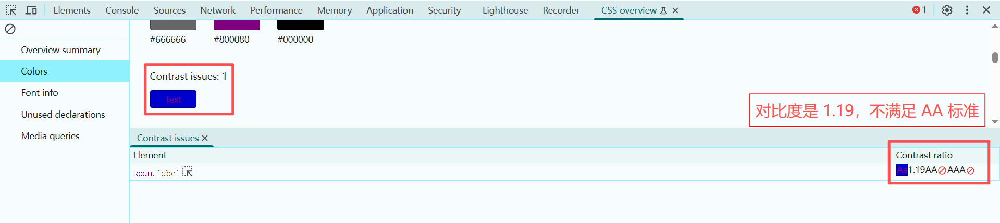
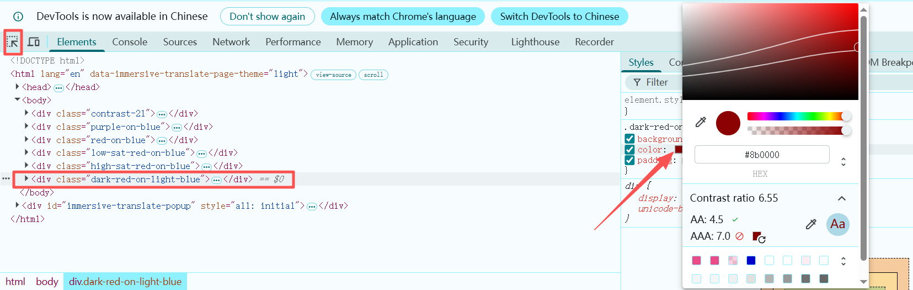
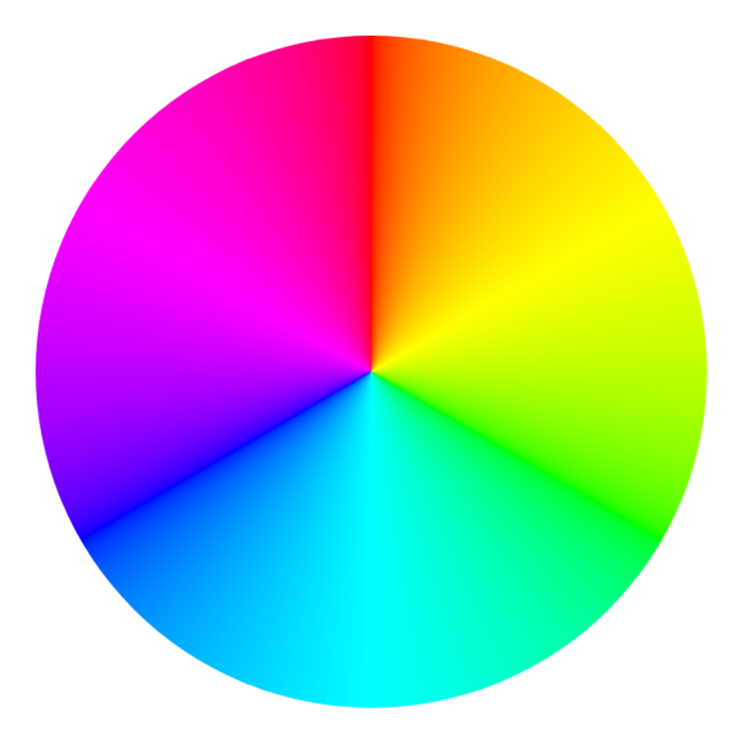
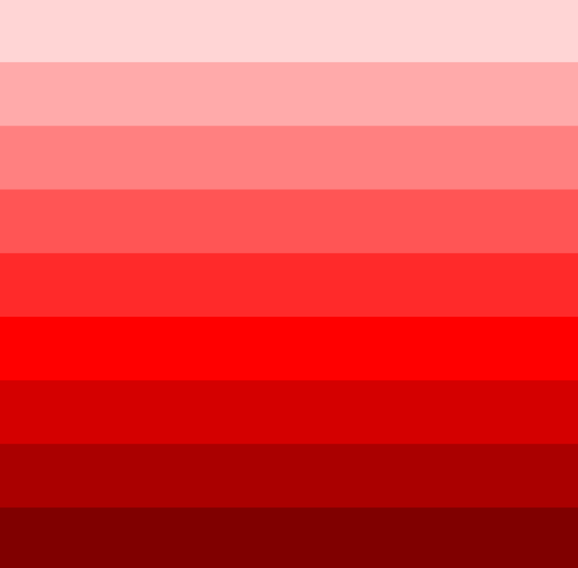
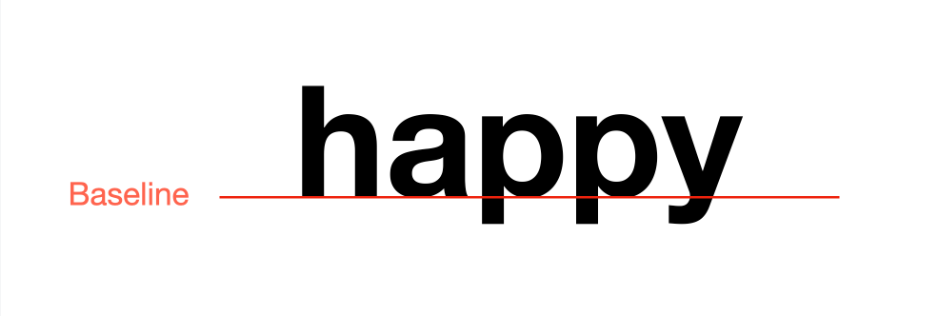
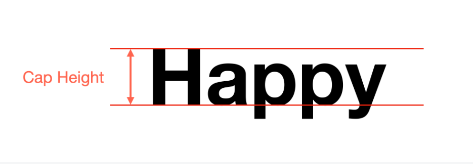
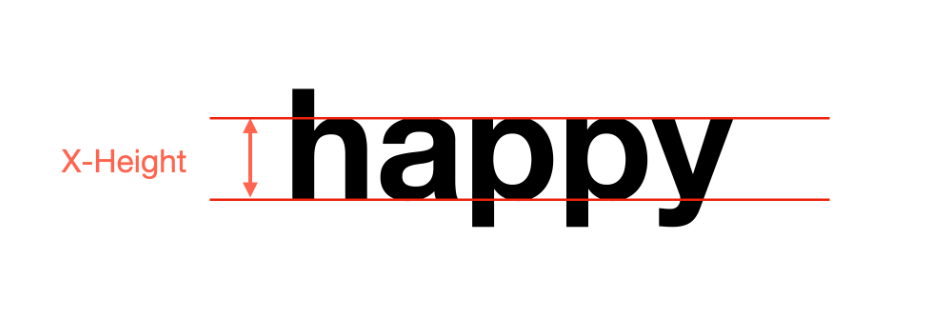
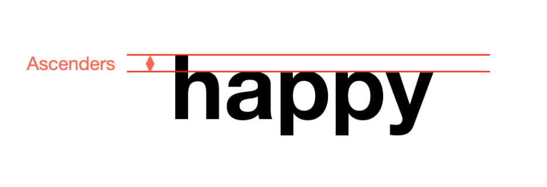
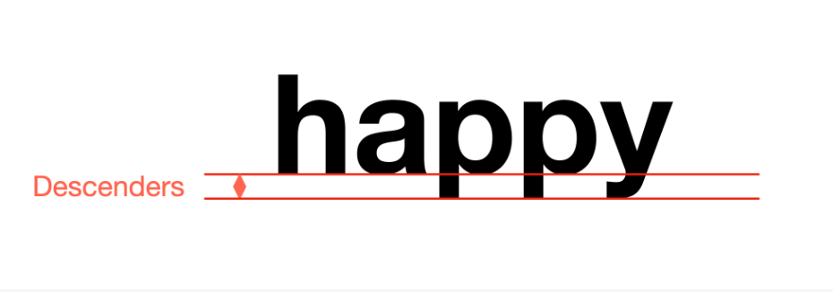
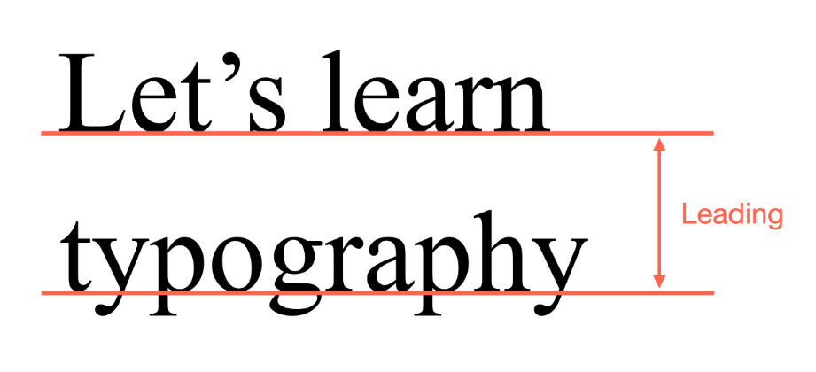

# CSS

## CSS 基础

### 什么是 CSS ？

CSS 叫做层叠样式表（Cascading Style Sheets），是用来给 HTML 文档内容设置样式的

CSS 的核心功能:

- 创建响应式设计

- 样式可以被继承和覆盖（层叠一词的由来）

样式由各种 **CSS 规则** 组成， CSS 规则由两部分组成: **选择器** 和 **声明块**

CSS 规则基本语法:

```css
selector {
    property: value;
}
```

可以为多个选择器应用同一份样式，选择器之间使用逗号隔开:

```css
selector1,
selector2 {
    property: value;
}
```

### meta viewport

meta viewport 元素是响应式网页设计中的关键组件，其基本语法如下:

```html
<meta name="viewport" content="width=device-width, initial-scale=1.0" />
```

这个元素通常放在 HTML 文档的 `<head>` 部分

其含义如下：

- `width=device-width` 告诉浏览器将页面宽度设置为与设备屏幕宽度相匹配

- `initial-scale=1.0` 设置页面首次加载时的初始缩放级别。值为 `1.0` 表示页面以 100% 缩放比例显示，不进行任何缩放。

通过使用 meta viewport 元素，您可以确保网页在移动设备上正确显示。

### 定义 CSS 的方式

#### 内联CSS inline css

内联 CSS 是直接在 HTML 元素中使用 `style` 属性编写的:

```html
<p style="color: green;">This is an inline-styled paragraph.</p>
```

内联 CSS 通常用于快速设置一次性样式，或覆盖特定元素的其他样式

#### 内部CSS internal css

内部 CSS 写在 HTML 文档 `head` 部分的 `style` 标签内

```html
<head>
    <style>
        p {
            color: blue;
        }
    </style>
</head>
<body>
    <p>This paragraph is styled using internal CSS.</p>
</body>
```

当您需要将样式应用于特定页面而非多个页面时，最好使用内部 CSS

#### 外部CSS external css

外部 CSS 写在单独的 `.css` 文件中，并通过 `head` 部分的 `link` 元素链接到 HTML 文档

```html
<head>
    <link rel="stylesheet" href="styles.css" />
</head>
<body>
    <p>This paragraph is styled using external CSS.</p>
</body>
```

```css
p {
    color: red;
}
```

外部 CSS 允许您对多个页面进行一致的样式设置，是专业网站开发中首选的方法

外部 CSS 非常适合希望在多个页面之间保持一致样式的大型项目，它提倡关注点分离，让 HTML 处理结构，CSS 处理样式，从而使代码更易于维护和扩展。

### width 和 height

在 CSS 中， `width` 和 `height` 属性用于控制网页上元素的尺寸。

高度和宽度可以用不同的单位定义，例如像素（ `px` ）、百分比（ `%` ）、视窗单位(viewport unit)（ `vw` 、 `vh` ）等等

`width` 和 `height` 属性如果不指定的话，默认值是 `auto`，浏览器会根据元素的内容、父元素和显示类型来确定元素的宽度和高度

对于 `div` 元素， `width: auto` 会使其扩展到填充其父容器的整个宽度。

我们还可以通过 `min-width`, `min-height` 以及 `max-width`, `max-height` 来对高度和宽度进行限制

```html
<head>
    <style>
         .box {
        <!-- 渲染宽度 150px -->
           width: 200px;
           max-width: 150px;
        <!-- 渲染高度 150px -->
           height: 200px;
           max-height: 150px;
           background-color: lightgreen;
         }
    </style>
</head>
<body>
    <div class="box"></div>
</body>
```

### CSS 组合器

CSS 组合器用于定义 CSS 选择器之间的关系，它主要通过元素之间的关系来选择元素

```html
<!DOCTYPE html>
<html lang="en">
    <head>
        <meta charset="utf-8" />
        <meta name="viewport" content="width=device-width;initial-scale=1.0" />
        <title>CSS</title>
        <style>
            div p {
                color: red;
            }

            #container > span {
                color: green;
            }

            #container + p {
                color: blue;
            }

            #container ~ span {
                color: cyan;
            }
        </style>
    </head>
    <body>
        <div id="container">
            <p>container 的直接子节点</p>
            <span>直接后代选择器只选择直接子节点</span>
            <section>
                <p>container 的间接子节点</p>
                <span>后代选择器会选择所有后代</span>
            </section>
        </div>
        <p>first sibling element p of container</p>
        <span>second sibling element span of container</span>
        <p>third sibling</p>
        <span>fourth</span>
    </body>
</html>
```

- **后代组合器（descendant combinator）**

    上面代码中的 `div p` 是一个后代组合器，它选择所有 `div` 元素的所有后代节点的 `p` 元素

    在这种情况下, `div` 是父选择器， `p` 是子选择器，父子选择器之间使用 **空格分隔**

- **子组合器（child combinator）**

    也可以叫直接后代组合器，上面的 `#container > span` 就是一个子组合器，它表示选择 `#container` 元素的直接孩子节点中的 `span` 元素

- **下一个兄弟组合器（next-sibling combinator）**

    选择指定元素的下一个兄弟元素, 比如 `#container + p` 只会选择紧随 `#container` 元素之后的 `p` 元素，要保证 `#container` 后面就是 `p`（紧随）

- **后续兄弟组合器（subsequent-sibling combinator）**

    `#container ~ span` 选择的目标是所有出现在 `#container` 元素之后的兄弟节点中的 `span` 元素

**组合器也叫做复合选择器**

### inline, block, inline-block

元素主要分为 **块级元素** 和 **行内元素**， 块元素的显示方式是: `display: block;`, 行内元素是: `display: inline;`

- 块级元素会占据父容器的全部宽度，他们总是另起一行，且可以调整宽度和高度

- 行内元素只占据所需的空间，他们会融入周围的内容中，不会换行显示

其实还有第三种显示方式: `display: inline-block;`

`inline-block` 是 `inline` 和 `block` 的混合体，它在布局上和 `inline` 类似，会保持在文本流中，不会另起一行。但是，它也可以像 `block` 一样调整高度和宽度

**简而言之**: `inline` 和 `inline-block` 的主要区别在于，`inline` 元素无法控制其大小，而 `inline-block` 元素允许完全控制尺寸，同时仍与其他内容保持对齐

### margin 和 padding

margin 表示元素的外边距，即元素边框与其他元素之间的间隔

padding 表示元素的内边距，即元素内容与其边框之间的距离

`margin` 有 4 种不同的属性: `margin-top`, `margin-right`, `margin-bottom`, `margin-left`

`padding` 也有 4 种不同的属性: `padding-top`, `padding-right`, `padding-bottom`, `padding-left`

在使用的时候我们可以通过这些属性来指定各个方向上的外边距或者内边距，但是我们有简写形式，可以一次性指定一个、两个、三个或四个值

- 一个值的情况

    ```css
    p {
        /* margin-top, margin-right, margin-bottom, margin-left 的值都指定为 10px */
        margin: 10px;
    }
    ```

- 两个值的情况

    ```css
    p {
        /** 第一个值指定的是 margin-top 和 margin-bottom, 第二个值指定的是 margin-right 和 margin-left */
        margin: 10px 20px;
    }
    ```

- 三个值的情况

    ```css
    p {
        /** 第一个值是 margin-top, 第二个值指定的是 margin-right 和 margin-left, 第三个值是 margin-bottom */
        margin: 10px 20px 30px;
    }
    ```

- 四个值的情况

    ```css
    p {
        /** 4 个值分别对应 margin-top, margin-right, margin-bottom, margin-left
    		从 margin-top 开始逆时针方向
    	 */
        margin: 10px 20px 30px 40px;
    }
    ```

### CSS 优先级

CSS 优先级是一个很重要的概念，当同时有多个规则定位到同一个元素时，到底适配哪个 CSS 规则？

首先看一般的优先级规则：

- 内联样式具有最高的优先级（如果不考虑使用 `!important` 的话）

- 内部样式和外部样式具有同样的优先级

- 优先级相同的情况下，后面的会覆盖前面的

对于选择器的优先级：

- **ID 选择器 &gt; 类选择器、属性选择器、伪类 &gt; 类型选择器（标签选择器）、伪元素 &gt; 通用选择器**

优先级值的计算分为 4 个部分: (a, b, c, d)

- `a`: 内联样式 1 或 0

- `b`: ID 选择器数量

- `c`: 类选择器、属性选择器和伪类（`:hover`、`:nth-child` 等）的数量

- `d`: 类型选择器、伪元素（`::before`、`::after` 等）的数量

- 通用选择器 `*`、组合器（`+` `>` `~` `空格`）和 `:where()` 不贡献任何权重，即 (0,0,0,0)

对于如下 css 规则:

```css
div#test span {
    color: green;
}
div span {
    color: blue;
}
span {
    color: red;
}
```

`div#test span` 的优先级是 (0, 1, 0, 2)

`div span` 的优先级是 (0, 0, 0, 2)

`span` 的优先级是 (0, 0, 0, 1)

### 继承

继承是 CSS 中的一个关键概念，它决定了样式如何从父元素传递到子元素。

在 CSS 中，并非所有属性都会默认继承。例如， `color` 、 `font-family` 和 `line-height` 等属性是会继承的。

另一方面，像 `margin` 、 `padding` 、 `border` 和 `background` 这样的属性默认情况下不会被继承。如果您希望子元素继承这些样式，则需要显式地设置它们，可以直接在子元素上设置，也可以使用 **inherit** 关键字。

`inherit` 关键字可用于强制从父元素继承属性，即使该属性通常不会被继承。

```html
<div style="padding: 20px;">
    This is the parent element with padding.
    <!-- 让 p 继承 div 的 padding 属性-->
    <p style="padding: inherit;">
        This is the child element inheriting the padding.
    </p>
</div>
```

需要注意的是，**继承是单向的**，只能从父元素继承到子元素。如果您覆盖子元素的样式，则不会影响父元素。

### 列表样式

#### 控制列表项之间的间距

我们可以通过 margin 来指定列表项之间的间距，比如给 `li` 选择器设置 `margin-bottom` 属性

有个时候也可以用 `line-height` 来间接实现列表项之间的间距

#### list-style 属性

在 CSS 中， `list-style` 属性用于控制网页上列表的外观。

`list-style` 属性实际上是其他三个属性的简写：

- `list-style-type` ，定义列表中使用的项目符号或数字的类型
    - 对于无序列表，您可以从多种项目符号样式中进行选择，例如圆点、圆形或方形。

    - 对于有序列表，您可以使用不同的编号系统，例如十进制、罗马数字，甚至字母字符。

- `list-style-position` ，控制项目符号或编号相对于列表项内容的位置。
    - 有两个值可以选择： `inside` 和 `outside`， 默认值是 `outside`

    - `outside` 表示项目符号或数字会出现在内容外部

    - `inside` 表示项目符号或数字会出现在内容内部，这可能会导致文本换行并与项目符号或数字对齐（当一个列表项的内容超过一行时，后面的行会与项目符号对齐）。

- `list-style-image`，使用图像作为列表项的符号标记

```html
<ul
    style="list-style: square inside url('https://cdn.freecodecamp.org/curriculum/cat-photo-app/relaxing-cat.jpg');"
>
    <li>Item 1</li>
    <li>Item 2</li>
    <li>Item 3</li>
</ul>
```

### 链接样式

默认的链接样式通常用蓝色表示未访问的链接，用紫色表示已访问的链接，这已经成为用户在浏览网站时所期望和依赖的标准。

默认样式相当于：

```css
a:link {
    color: blue;
    text-decoration: underline;
}

a:visited {
    color: purple;
}
```

我们可以修改默认样式:

```css
a:link {
    color: blue;
    text-decoration: none;
    border-bottom: 1px solid blue;
}

a:visited {
    color: purple;
    border-bottom: 1px solid purple;
}
```

我们还可以给链接的其他状态设置样式:

```css
a:hover {
    color: red;
}

a:active {
    color: darkorange;
}
```

链接的状态有:

- `link` 尚未访问的链接

- `visited` 已访问或点击过的链接

- `hover` 鼠标悬停在链接上时

- `focus` 链接获得焦点时

- `active` 链接被点击时

这些状态可以使用 CSS 中的 `pseudo-classes` （伪类）来设置样式。

伪类是添加到选择器中的一个关键字，用于指定所选元素的特殊状态。

伪类语法大致如下：

```css
/** A 是选择器, :B 是伪类 */
A:b {
    property: value;
}
```

**请注意**: 这 5 个伪类如果作用于同一个链接（`<a>` 标签），必须遵循 **LVFHA** 顺序:

```css
a:link {
    color: blue;
}

a:visited {
    color: purple;
}

a:focus {
    outline: 2px solid orange;
}

a:hover {
    color: red;
}

a:active {
    color: green;
}
```

**核心原因**: CSS 层叠规则（优先级相同的情况下，后定义的覆盖先定义的）。这 5 个伪类的优先级（特异性）完全相同，所以书写在后面的样式会覆盖前面的。

### 背景图片

在 CSS 中使用背景图像时，您可以使用多个属性来控制这些图像的显示方式。

比较重要的几个属性是: `background-size`, `background-repeat`, `background-position` 和 `background-attachment`

我们先来看一下 `background-image` 属性:

```css
body {
    background-image: url('https://cdn.freecodecamp.org/curriculum/cat-photo-app/relaxing-cat.jpg');
}
```

- `background-size`
    - `contain`

        你可以使用 `contain` 将图片放大到尽可能大，而不会裁剪或拉伸：

        ```css
        body {
            background-image: url('https://cdn.freecodecamp.org/curriculum/cat-photo-app/relaxing-cat.jpg');
            background-size: contain;
            min-height: 100px;
        }
        ```

    - `cover`

        使用 `cover` 值，那么背景图像就会缩放以覆盖整个 body 元素，同时保持其宽高比

        ```css
        body {
            background-image: url('https://cdn.freecodecamp.org/curriculum/cat-photo-app/relaxing-cat.jpg');
            background-size: cover;
            min-height: 100px;
        }
        ```

        默认情况下，背景图片会在水平和垂直方向上重复排列，以填充整个父容器。不过，您可以通过 `background-repeat` 控制此行为。

- `background-repeat`
    - 图像不重复显示

        ```css
        body {
            background-image: url('https://cdn.freecodecamp.org/curriculum/cat-photo-app/relaxing-cat.jpg');
            background-size: contain;
            background-repeat: no-repeat;
            min-height: 100px;
        }
        ```

    - 图像水平方向重复

        将 `background-repeat` 的值设置为 `repeat-x` 即可实现水平重复

        ```css
        body {
            background-image: url('https://cdn.freecodecamp.org/curriculum/cat-photo-app/relaxing-cat.jpg');
            background-size: contain;
            background-repeat: repeat-x;
            min-height: 100px;
        }
        ```

    - 图像垂直方向重复

        将 `background-repeat` 的值设置为 `repeat-y` 即可实现垂直重复

- `background-position`

    要将背景图像定位到屏幕上，可以使用 `background-position` 属性。

    `background-position` 属性允许您设置背景图像在元素中的显示位置。您可以使用 `top` 、 `bottom` 、 `left` 、 `right` 和 `center` 等关键字，也可以使用特定的像素值或百分比值。

    ```css
    body {
        background-image: url('https://cdn.freecodecamp.org/curriculum/cat-photo-app/relaxing-cat.jpg');
        background-size: contain;
        background-repeat: no-repeat;
        background-position: center top; /** 水平中心，垂直顶部 */
        min-height: 100px;
    }
    ```

- `background-attachment`

    `background-attachment` 决定了背景图像是随内容滚动还是在页面滚动时保持固定。

    主要取值:
    - `scroll` （默认值），背景图像随内容滚动
    - `fixed` ，背景图像保持在屏幕上的同一位置。

    ```css
    body {
        background-image: url('https://cdn.freecodecamp.org/curriculum/cat-photo-app/relaxing-cat.jpg');
        background-position: center top;
        background-attachment: fixed; /** 背景图像保持在固定位置 */
    }
    ```

---

`background` 属性可以将上述几个属性合并到一起进行设置:

```css
body {
    background: center top fixed
        url('https://cdn.freecodecamp.org/curriculum/cat-photo-app/relaxing-cat.jpg');
}
```

上述代码相当于将 `background-image` 设置为 `url('https://cdn.freecodecamp.org/curriculum/cat-photo-app/relaxing-cat.jpg');`，将 `background-position` 设置为 `center top`， 将 `background-attachment` 设置为 `fixed`

### 背景渐变

CSS 中有两种主要类型的渐变：**线性渐变** 和 **径向渐变**

#### 线性渐变 linear-gradient

线性渐变是指颜色沿直线过渡。您可以定义渐变的方向和涉及的颜色。

基本语法:

```css
selector {
    background: linear-gradient(direction, color-stop1, color-stop2, ...);
}
```

- `direction` 是指渐变方向，可以是关键词如 `to right`, `to bottom`; 也可以是具体的角度如 `45deg` （45° 方向）

- `color-stop` 颜色停止点

下面看一个具体的例子:

```css
.linear-gradient {
    background: linear-gradient(to right, red, yellow);
    height: 40vh;
}
```

如果只想中间的某一部分施行颜色渐变，可以指定颜色占比：

```css
.linear-gradient {
    /* 0%-30% 纯红，30%-70% 红黄渐变，70%-100% 纯黄 */
    background: linear-gradient(to right, red 30%, yellow 70%);
    height: 40vh;
}
```

#### 径向渐变 radial-gradient

径向渐变是指颜色从 **原点**（通常是中心）向外呈圆形或椭圆形辐射过渡。

基本语法:

```css
selector {
    background: radial-gradient(
        shape size at position,
        color-stop1,
        color-stop2,
        ...
    );
}
```

- `shape` 指定渐变形状， 如 `circle`, `ellipse`

- `size` 决定了渐变结束形状的大小, 主要取值： `closest-side` 、 `closest-corner` 、 `farthest-side` 或 `farthest-corner`

- `position` 决定渐变中心的位置，可以使用关键字如 `center`, `top left`, `bottom right`；也可以使用精确值如 `50% 50%`, `10px 20px` 等

- `color-stop` 是颜色停止点

具体示例:

```css
.radial-gradient {
    background: radial-gradient(
        circle closest-side at center,
        red,
        yellow 50%,
        green
    );
    height: 60vh;
}
```

### 给图片添加边框

#### border 属性

给图片添加边框最直接的方法是使用 `border` 属性。这个属性是一种简写方式，可以让你一次性设置边框的宽度、样式和颜色。

```css
img {
    border: 2px solid red;
}
```

如果需要对边框的各个边进行更精细的控制，可以使用每个边的特定边框属性：

```css
img {
    border-top: 10px solid red;
    border-right: 10px dashed green;
    border-bottom: 10px dotted blue;
    border-left: 10px double purple;
}
```

#### outline 属性

创建边框效果的另一种方法是使用 `outline` 属性。 `outline` 不会影响元素的尺寸或布局：

```css
img {
    outline: 3px solid gold;
}
```

#### 给边框设置圆角

如果要为边框创建圆角，可以将 `border-radius` 属性与 `border` 属性结合使用：

```css
img {
    border: 2px solid black;
    border-radius: 10px;
}
```

## 设计 Design

### 常见设计相关术语

#### 布局 Layout

布局是指在页面或屏幕上如何排列视觉元素以传达信息。这些元素可能包括文本、图像和留白。布局就像设计的蓝图。设计师必须考虑每个元素的位置、大小和层级关系。

#### 对齐 Alignment

对齐是指元素彼此之间的放置关系。

#### 构图 Composition

构图是安排元素以创造和谐设计的艺术。

布局主要关注元素的放置位置，而构图还会考虑这种放置方式对整体设计的艺术影响。

#### 平衡 Balance

平衡是指 **视觉重量** 在画面中的分布方式。设计师力求通过对称或不对称的布局来创造一种平衡感。平衡的设计给人以和谐之感。

#### 层级 Hierarchy

层级确立了设计中各个元素的优先顺序，确保最重要的信息首先被注意到。你可以通过大小、颜色、对比度、对齐方式、留白甚至字体来实现视觉层级。

#### 对比度 Contrast

使用合适的对比度可以清晰的展现各个元素，高对比度能提高可读性。

#### 留白 White Space

留白，也称为“负空间”，是指设计中的空白区域，也就是元素周围的区域。你可能会惊讶地发现，留白不一定是白色的。实际上，它可以是任何颜色或纹理的空间。留白的作用是提高设计的可读性，并增强视觉层次感。

#### 用户界面 User Interface, UI

用户界面（也称 UI）是指人与计算机交互的方式。用户界面包括用户在屏幕上可以看到的视觉和交互元素，例如图标、图像、文本、菜单、链接和按钮。

#### 用户体验 User Experience, UX

用户体验（UX）是指用户在使用产品或服务时的感受。一款用户体验设计良好的应用程序应该直观易用、高效便捷、方便访问且令人愉悦。用户界面在提升用户体验的便捷性和愉悦感方面起着关键作用，因此两者密切相关。

### 如何设计良好的背景和前景对比？

**对比度** 是指两种颜色之间的差异，或者说，区分它们的难易程度。

对比度越高的颜色在视觉上就越容易区分，而对比度越低的颜色在视觉上就越相似。

但如何判断对比度是否“足够好”呢？你不能仅仅根据文本的视觉效果来判断，因为每个用户的体验都不同。

WCAG（网页内容无障碍指南，Web Content Accessibility Guidelines）给我们提供了标准：

- 对比度为 `4.5:1` 的文本被认为是 AA 标准，这是确保大多数用户都能访问的最低标准。

- 对比度为 `7:1` 的文本被认为是 AAA 标准，可确保最佳的可访问性。

有很多网站可以检查两种颜色之间的对比度，但大多数浏览器都允许您直接在网站的开发者工具中执行此操作。

<br>
<br>

下面是一个演示对比度的示例：

```html
<!DOCTYPE html>
<html lang="en">
    <head>
        <meta charset="utf-8" />
        <meta name="viewport" content="width=device-width, initial-scale=1.0" />
        <title>freeCodeCamp</title>
        <link rel="stylesheet" href="styles.css" />
    </head>
    <body>
        <div class="contrast-21">
            <span class="label">Contrast Ratio 21:1</span>
            This is black text on a white background, which has the highest
            contrast ratio of 21:1.
        </div>

        <div class="purple-on-blue">
            <span class="label">Purple on Blue (Lower Contrast)</span>
            This doesn't meet the AA standard.
        </div>

        <div class="red-on-blue">
            <span class="label">Red on Blue (Higher Contrast Hue Shift)</span>
            This doesn't meet accessibility standards.
        </div>

        <div class="low-sat-red-on-blue">
            <span class="label"
                >Low Saturation Red on Blue (Contrast ~1.49:1)</span
            >
            This red has low saturation, resulting in a poor contrast ratio.
        </div>

        <div class="high-sat-red-on-blue">
            <span class="label"
                >Higher Saturation Red on Blue (Contrast ~3.54:1)</span
            >
            Increasing the saturation of red improves contrast but it’s still
            below AA standard.
        </div>

        <div class="dark-red-on-light-blue">
            <span class="label"
                >Darker Red on Light Blue (Contrast ~10.34:1)</span
            >
            Decreasing the lightness of the red increases the contrast ratio
            significantly.
        </div>
    </body>
</html>
```

```css
.contrast-21 {
    background-color: white;
    color: black;
    padding: 15px;
    font-family: sans-serif;
    font-size: 18px;
    margin-bottom: 20px;
}

.label {
    font-weight: bold;
    margin-bottom: 8px;
    display: block;
}

.purple-on-blue {
    background-color: #0000cc;
    color: #800080;
    padding: 15px;
    font-family: sans-serif;
    font-size: 18px;
    margin-bottom: 20px;
}

.red-on-blue {
    background-color: #0000cc;
    color: #ff0000;
    padding: 15px;
    font-family: sans-serif;
    font-size: 18px;
    margin-bottom: 20px;
}

.low-sat-red-on-blue {
    background-color: #0000cc;
    color: #b23333;
    padding: 15px;
    font-family: sans-serif;
    font-size: 18px;
    margin-bottom: 20px;
}

.high-sat-red-on-blue {
    background-color: #0000cc;
    color: #ff4d4d;
    padding: 15px;
    font-family: sans-serif;
    font-size: 18px;
    margin-bottom: 20px;
}

.dark-red-on-light-blue {
    background-color: #add8e6;
    color: #8b0000;
    padding: 15px;
}
```

### 以用户为中心的设计

#### 什么是以用户为中心的设计？

以用户为中心的设计是一种网页开发方法，它优先考虑最终用户，包括他们的需求、偏好和限制。

以用户为中心的设计首先要考虑的是目标用户群体。例如，如果你的目标用户群体比较年轻，你可以采用更炫酷、更吸引眼球的设计，迅速抓住他们的注意力。而对于年龄较大的用户群体，你则应该更注重简洁明了、避免干扰的设计。

用户行为也是一个重要因素。您需要利用分析工具（例如 Google Analytics）来衡量用户如何与您的页面互动。这可以揭示用户可能遇到的“卡住”并离开页面的地方，或者发现改进整体交互流程的机会。

以用户为中心的设计关键在于真正让用户参与其中。提供一个反馈渠道，让用户分享他们在使用网站的体验和痛点，可以帮助你收集重要信息并进行迭代改进。归根结底，以用户为中心的设计意味着你需要将用户置于决策的首位，无论是通过调研还是直接反馈。

#### 用户研究、用户测试和用户需求

**用户研究** 是对使用您产品的人群进行系统性研究。其目标是衡量用户的需求、行为和痛点。

用户研究的形式多种多样。其中最常见的或许是 **净推荐值（Net Promoter Score，NPS）**。NPS 衡量的是用户向朋友推荐您产品的可能性。

NPS 的测量方法是在用户使用过程中的关键节点（例如 7 天、30 天和 90 天后）进行调查。NPS 的评分范围为 0 到 10，9 分和 10 分表示用户是您网站的积极推荐者。

另一种研究方法是用户流失调研。这是一种在用户取消订阅或删除帐户时向他们展示的调查问卷。通过这项调查，您可以深入了解导致用户流失的因素，从而采取相应的措施。

**用户测试** 指的是在用户与应用程序交互时收集数据的过程。

作为一名 Web 开发人员，你可能会遇到 A/B 测试。A/B 测试是指将新功能推送给随机选择的用户群体子集。然后，你可以利用分析数据来确定该功能是否有效。

**用户需求** 指的是应用程序需要遵循的故事或准则。它可以指导开发过程。用户需求可以通过用户调研、行业标准或利益相关者的反馈来定义。

#### 深色模式

深色模式是网页应用程序的一项特殊功能，它可以将默认的浅色配色方案更改为深色配色方案。这有助于减少眼睛疲劳，并提高弱光环境下的阅读体验。在设计深色模式功能时，了解最佳实践至关重要，以确保其有效且易于使用。

最佳实践：

- 在深色模式下应避免使用饱和度高的颜色。在深色模式下，低饱和度的颜色视觉效果更舒适

- 相比于纯黑背景搭配白色文字，建议使用深灰色背景搭配浅灰色文字，以获得更柔和的对比度。

- 在实施深色模式时，您应该考虑如何使深色模式功能与品牌的颜色和风格保持一致。
    - 品牌标识是一组代表品牌的视觉元素，例如徽标、颜色和字体。
    - 将品牌图标和按钮设置为全饱和度，而周围元素降低饱和度，也是可以的。

在设计时，始终要关注用户体验和对比度。深色模式也不例外，遵循以下最佳实践，即可创建高效且用户友好的深色模式功能。

#### 面包屑导航

在网页层级比较深的网站上经常可以看到类似 `Homepage/articles/java/jvm` 这样子的导航，这种导航称为 **面包屑导航（Breadcrumb Navigation）**

最佳实践：

- 只有在网页层级复杂的设计中才应该使用这种导航

- 面包屑导航应该放在显眼的位置，方便用户找到。一般放在主导航栏的上方或者下方

- 面包屑导航的字体不能太小，但也不能太大（防止长路径占用过多空间）

#### 卡片设计

最佳实践：

- 卡片设计的首要原则是 **简洁**。

- 需要考虑用户可以点击卡片的位置。
    - 有些卡片设计只有一个按钮，用户可以很直观地知道点击位置。
    - 而另一些卡片设计则允许整个卡片都可点击。当用户将鼠标悬停在卡片的任何部分时，卡片会改变颜色或添加阴影效果，以提示该卡片可点击。
    - 无论选择哪种设计，都必须在整个网站中保持一致，并且易于用户理解。

- 卡片上媒体素材的使用
    - 选择高质量的媒体素材可以显著提升用户体验。

- 色彩层级的使用
    - 你需要确保卡片上最重要的信息最为醒目。你可以使用鲜艳的颜色来表示重要元素，例如行动号召按钮（call-to-action，CTA），而使用浅色来表示卡片上不太重要的元素。

#### 无限滚动

无限滚动是一种设计模式，它会随着用户向下滚动页面而加载更多内容。这种模式常用于 Twitter 等社交媒体网站。

无限滚动也常被用来替代分页。分页是一种将内容分成多个页面的设计模式。当需要显示大量内容时，通常会使用分页。

最佳实践：

- 要提供一个“加载更多”按钮，用户点击后即可加载下一组结果。这样可以让用户更好地控制何时查看更多内容。

- 另一个可以考虑的方案是添加“返回”按钮。这样用户无需向上滚动即可返回上一页。这能提升用户体验，并让他们更好地掌控浏览过程。

- 有时你会看到一些设计中带有“返回顶部”按钮，点击即可返回搜索结果页面的顶部。另一个需要考虑的因素是提供加载指示器。用户应该能够清晰地看到正在加载更多内容；否则，他们可能会误以为页面出现故障。

- 确保用户能够随时访问页脚。如果页脚包含重要信息，则应确保用户始终可以访问。

#### 模态对话框 Modal Dialog

模态对话框（Modal Dialog Box）是一种弹窗界面元素，它会强制打断用户的操作流程。在关闭该对话框或做出响应（如点击“确定”或“取消”）之前，用户无法与主窗口或应用程序的其他部分进行交互。

HTML 中有一个 `dialog` 元素，可以用来创建模态框。

```html
<button id="open-modal">Open Modal</button>
<dialog>
    <h2>Subscribe to our Newsletter!</h2>
    <p>Get the latest updates and offers.</p>
    <button>Subscribe</button>
    <button>Close</button>
</dialog>
```

```css
dialog {
    border: none;
    border-radius: 8px;
    padding: 20px;
    box-shadow: 0 4px 8px rgba(0, 0, 0, 0.2);
}

dialog::backdrop {
    background: rgba(0, 0, 0, 0.5);
}
```

```js
const dialog = document.querySelector('dialog');
const closeButton = dialog.querySelector('button:last-of-type');
const openModalButton = document.getElementById('open-modal');

closeButton.addEventListener('click', () => {
    dialog.close();
});

openModalButton.addEventListener('click', () => {
    dialog.showModal();
});

// Close the modal when clicking outside of it
dialog.addEventListener('click', (event) => {
    const rect = dialog.getBoundingClientRect();
    const isInDialog =
        event.clientX >= rect.left &&
        event.clientX <= rect.right &&
        event.clientY >= rect.top &&
        event.clientY <= rect.bottom;
    if (!isInDialog) {
        dialog.close();
    }
});
```

- 允许用户点击模态框外部将其关闭始终是一个好主意。

- 模态框也应该有关闭按钮。虽然你可能很希望用户点击你的行动号召按钮，但重要的是要让他们可以选择退出模态框，并继续他们之前正在进行的操作。

#### 进度指示 Progress Indication

进度指示是一种向用户展示他们在流程中所处阶段的方式。它可以用于表单、注册和设置流程中。其目的是帮助用户了解他们所处的流程阶段以及还需要完成多少步骤。

最佳实践：

- 保持简洁

- 允许用户返回到之前的步骤

- 确保进度指示部分易于查找

- 要有清晰的章节标题、百分比或步骤说明

一个示例：

```html
<!DOCTYPE html>
<html lang="en">
    <head>
        <meta charset="utf-8" />
        <meta name="viewport" content="width=device-width, initial-scale=1.0" />
        <title>freeCodeCamp</title>
        <link rel="stylesheet" href="styles.css" />
    </head>
    <body>
        <form id="multiStepForm">
            <div class="form-progress">
                <label class="progress-label">Form progress</label>
                <div class="progress-container">
                    <div class="progress-bar"></div>
                    <div class="progress-text">Step 1 of 3</div>
                </div>
            </div>

            <!-- Step 1 -->
            <fieldset class="form-step active">
                <legend>Personal Information</legend>
                <label for="name">Full Name:</label>
                <input type="text" id="name" name="name" required />

                <label for="email">Email:</label>
                <input type="email" id="email" name="email" required />

                <button type="button" class="next-btn">Next</button>
            </fieldset>

            <!-- Step 2 -->
            <fieldset class="form-step">
                <legend>Address</legend>
                <label for="address">Street Address:</label>
                <input type="text" id="address" name="address" required />

                <label for="city">City:</label>
                <input type="text" id="city" name="city" required />

                <button type="button" class="prev-btn">Previous</button>
                <button type="button" class="next-btn">Next</button>
            </fieldset>

            <!-- Step 3 -->
            <fieldset class="form-step">
                <legend>Review & Submit</legend>
                <p>Please review your information before submitting.</p>

                <button type="button" class="prev-btn">Previous</button>
                <button type="submit">Submit</button>
            </fieldset>
        </form>

        <script src="index.js"></script>
    </body>
</html>
```

```css
.form-progress {
    max-width: 500px;
    margin: 20px auto 30px;
    font-family: Arial, sans-serif;
}

.progress-label {
    display: block;
    margin-bottom: 8px;
    font-size: 16px;
    font-weight: 600;
    color: #333;
}

.progress-container {
    position: relative;
    background-color: #555;
    border-radius: 8px;
    height: 30px;
    overflow: hidden;
    box-shadow: inset 0 1px 3px rgba(0, 0, 0, 0.3);
}

.progress-bar {
    background-color: #4caf50;
    height: 100%;
    width: 0;
    border-radius: 8px 0 0 8px;
    transition: width 0.3s ease;
}

.progress-text {
    position: absolute;
    top: 0;
    left: 0;
    width: 100%;
    height: 30px;
    line-height: 30px;
    text-align: center;
    font-weight: bold;
    color: #fff;
    pointer-events: none;
    user-select: none;
}

form {
    max-width: 500px;
    margin: 0 auto;
    font-family: Arial, sans-serif;
}

fieldset {
    border: none;
    padding: 0;
    margin: 0 0 20px;
}

legend {
    font-size: 1.2em;
    font-weight: 700;
    margin-bottom: 10px;
    color: #222;
}

label {
    display: block;
    margin-bottom: 6px;
    font-weight: 600;
    color: #333;
}

input[type='text'],
input[type='email'] {
    width: 100%;
    padding: 8px 10px;
    font-size: 1em;
    border: 1px solid #ccc;
    border-radius: 4px;
    margin-bottom: 15px;
    box-sizing: border-box;
    transition: border-color 0.2s ease;
}

input[type='text']:focus,
input[type='email']:focus {
    outline: none;
    border-color: #4caf50;
    box-shadow: 0 0 5px rgba(76, 175, 80, 0.5);
}

.form-step {
    display: none;
}

.form-step.active {
    display: block;
}

button {
    background-color: #4caf50;
    border: none;
    color: white;
    padding: 10px 18px;
    font-size: 1em;
    border-radius: 5px;
    cursor: pointer;
    margin-right: 10px;
    transition: background-color 0.2s ease;
}

button:hover:not(:disabled) {
    background-color: #45a049;
}

button:disabled {
    background-color: #9e9e9e;
    cursor: not-allowed;
}

@media (max-width: 600px) {
    .form-progress,
    form {
        max-width: 90%;
        margin: 20px auto;
    }
}
```

```js
const form = document.getElementById('multiStepForm');
const steps = form.querySelectorAll('.form-step');
const progressBar = form.querySelector('.progress-bar');
const progressText = form.querySelector('.progress-text');
const totalSteps = steps.length;

let currentStep = 0;

function updateProgress() {
    const percent = ((currentStep + 1) / totalSteps) * 100;
    progressBar.style.width = percent + '%';
    progressText.textContent = `Step ${currentStep + 1} of ${totalSteps}`;
}

function showStep(index) {
    steps.forEach((step, i) => {
        step.classList.toggle('active', i === index);
    });
    updateProgress();
}

form.querySelectorAll('.next-btn').forEach((btn) => {
    btn.addEventListener('click', () => {
        if (currentStep < totalSteps - 1) {
            currentStep++;
            showStep(currentStep);
        }
    });
});

form.querySelectorAll('.prev-btn').forEach((btn) => {
    btn.addEventListener('click', () => {
        if (currentStep > 0) {
            currentStep--;
            showStep(currentStep);
        }
    });
});

showStep(currentStep);

form.addEventListener('submit', (e) => {
    e.preventDefault();
    alert('Form submitted!');
});
```

#### 购物车

最佳实践：

- 确保用户始终可以看到购物车。大多数购物车设计都会将其显示在页面右上角。

- 用户应该能够在购物车图标旁边看到购物车中的商品数量，并且可以点击购物车查看所购商品的更多详细信息。

- 为用户提供清晰便捷的方式来更新购物车中的商品数量。这可以通过在购物车中每个商品旁边添加数量输入框来实现。用户只需在输入框中更改数字即可轻松更新商品数量。

- 您还应该在购物车中的每个商品旁边提供一个“移除”按钮。这样用户就可以轻松地从购物车中移除商品。

- 购物车图标应该易于所有用户识别。常见的图标是带把手和轮子的购物车。其他图标可以是购物袋或购物篮。但你不希望选择过于抽象或难以理解的图标。

- 当用户想要查看购物车总价时，应该能够轻松找到购物车中所有商品的总价。总价应该醒目地显示在页面上，以免用户费力查找。

- 您应该提供一个清晰的行动号召按钮（CTA），引导用户进入结账页面。

### 通用设计工具

#### 设计简报 Design Briefs

在设计新功能或应用程序时，一个好的第一步是制定设计简报。

设计简报是一份文件，它概述了项目的目标和需求。它就像一张路线图，指导设计过程，并确保最终产品满足客户的需求。

设计简报中应包含几个关键要素：

- 对项目和业务的概述。该概述应包括公司的详细信息、使命、价值观、独特卖点以及产品或服务。

- 记录项目的目标和目的
    - 预期成果
    - 增加网站流量或将每月页面访问量增加 X%

- 设计简报应包含目标受众的人口统计信息、兴趣爱好和需求

- 应包括交付成果、时间表和预算。 交付成果应包括项目过程中将要产出的所有物品清单，例如模型和最终设计。

项目设计面临的挑战之一是时间安排和预算控制。在既定的时间和预算范围内，对能够实现的目标保持务实的态度至关重要。因此，制定一份概述这些限制条件的设计简报非常重要。

#### 开发人员应该了解的一些常用设计工具

- **Figma**

    Figma 是开发者应该掌握的最常用、最基本的界面设计工具之一。

    这款基于云端的工具专注于用户界面和用户体验 (UI/UX) 设计。它支持设计和开发团队随时随地协作，并提供以下内置功能：
    - Vector-based design 基于矢量的设计
    - Automatic layout 自动布局
    - Commenting and feedback system 评论和反馈系统
    - Version history 版本历史记录
    - Real-time collaboration 实时协作
    - Design systems, and more. 设计系统等等。

    要开始使用 Figma，您可以使用其网页版界面，也可以下载桌面应用程序到您的电脑上。它提供丰富的免费功能，因此您无需购买专业版即可完成许多工作。

- **Sketch**

    Sketch 是开发者应该熟悉的另一款重要设计工具。与 Figma 类似，它基于矢量图形，主要用于 UI/UX 设计。

    Sketch 因其直观的界面和简洁性而广受欢迎，是开发人员快速创建原型的不二之选。它也被设计师广泛用于创建用户界面、图标和网页布局等任务。

    Sketch 的主要局限在于它缺乏基于云的界面，并且只能在 macOS 上使用。

- **Adobe XD**

    Adobe XD 是另一款基于矢量的 UI/UX 设计原型制作工具，以其与 Photoshop、Illustrator 和 After Effects 等其他 Adob​​e 应用程序的无缝集成而闻名。

    Adobe XD 同时支持 Windows 和 macOS 系统，并包含基于云端的界面。

- **Canva**

    你可以使用 Canva 创建各种视觉内容，包括海报、封面照片、演示文稿、短视频等等。它用户友好且简洁的设计使其成为初学者的理想之选。

    此外，Canva 还提供丰富的模板、图像和设计元素库，使创建专业外观的设计变得轻松便捷。

    Canva 还支持网页界面设计，并允许与团队成员协作。该平台可在网页、桌面端、安卓和 iOS 应用上使用。

- **其他工具**

    其他开发人员应该了解的常用设计工具包括 Framer、InVision、Adobe Photoshop、Adobe Illustrator 和 Miro。

## 单位

在设计页面时，您会用到各种属性，例如宽度、高度、内边距、外边距等等。定义这些属性时，您需要指定要使用的长度单位。

可以使用两种单位：**相对单位** 和 **绝对单位**。

### 绝对单位 Absolute Unit

最常用的绝对单位是 **像素**（`px`），像素是 CSS 中的固定尺寸计量单位，可以精确控制尺寸。这意味着 `1` 像素始终等于 `1/96` 英寸。

需要注意的是，虽然 1px 在 CSS 布局中被标准化为 1/96 英寸，但像素的实际物理尺寸可能会因显示器而异。

其他类型的绝对单位：

- `in`, 表示 inch，等于 96 个像素

- `cm`， 厘米 `1 cm = 25.2/64 inch`

- `mm`，毫米

- `q`，四分之一毫米 `1 q = 1/40 cm`

- `pc`，Pica 派卡 `1 pc = 1/6 inch`

- `pt`，Point 点 `1 pt = 1/72 inch`

这些单位大部分都用于打印而非屏幕显示

### 百分比

CSS 中的百分比是 **相对单位**，允许您将大小、尺寸和其他属性定义为其 **父元素的比例**。使用百分比值时，您实际上是在说：“将此元素的大小设置为其容器的 X%”。

百分比非常适合创建能够适应各种屏幕尺寸的自适应布局。例如，将容器的 width: 80% 即可确保无论在何种设备上，它都占据其父元素宽度的 80%。

### em & rem

#### em

`em` 单位是相对于元素的字体大小而言的。如果字体大小属性本身使用了 `em` 单位，那么它将会是相对于父元素的字体大小而言的。

举个例子：

```html
<!DOCTYPE html>
<html lang="en">
    <head>
        <meta charset="utf-8" />
        <meta name="viewport" content="width=device-width, initial-scale=1.0" />
        <title>freeCodeCamp</title>
        <link rel="stylesheet" href="styles.css" />
    </head>
    <body>
        <p class="para">I am a paragraph element</p>

        <div class="blue-box"></div>
    </body>
</html>
```

```css
.para {
    font-size: 20px;
    margin-bottom: 1.5em; /** 因为当前元素设置了 font-size 属性，所以这里的 1.5em = 30px */
    border: 2px solid red;
}

.blue-box {
    background-color: blue;
    color: white;
    padding: 10px;
    width: 100px;
    height: 100px;
}
```

一个段落，一个方块。我们给段落的底部设置了 `1.5em` 的距离，前面说了 `em` 单位是相对于元素的字体大小而言的，段落的字体大小是 `20px`，因此这里的 `1.5em` 其实等于 `30px`

若是我们将 `.para` 的 `font-size` 属性给去掉，那么 `margin-bottom` 的 `1.5em` 则是相对于父元素的字体大小而言，其父元素是 `body`，`body` 没有默认的 `font-size`, 但它会继承 `html`的 `font-size`，`html` 的默认字体大小是 `16px`，因此，这里的 `1.5em` 将会是 `24px`

> CSS 中，`font-size` 是一个 **继承属性**。如果当前元素没有显式设置 `font-size`，它不会直接去“看”父元素有没有写 `font-size` 样式，而是 **直接继承父元素计算后的最终字体大小**。

其实本质上是这样处理的：

- 如果父元素也没有设置，就继承祖父元素的。

- 如果所有祖先都没有设置，最终会一直追溯到根元素 `<html>`。

- 如果 `<html>` 也没有设置，浏览器会使用默认值，通常是 `16px`。

#### rem

rem 单位是相对于根元素，即 `<html>` 元素的字体大小而言的

默认情况下，浏览器赋予 `<html>` 的默认字体大小是 `16px`, 如果用户在浏览器设置中增大字体，那么 `<html>` 元素的字体会增大，从而所有 `rem` 单位都会按比例进行缩放

```css
.para {
    font-size: 1.2rem; /** rem 是相对于 html 元素的 font-size 而言的, 假设 html 的 font-size 是 16px, 那么 1.2rem = 19.2px */
    margin-bottom: 1.5em; /** 假设 html 的 font-size 是 16px, 1.5rem = 24px */
    border: 2px solid red;
}
```

与 `em` 的区别:

- `em` 单位是相对于元素自身或其父元素的字体大小的

- `rem` 单位是相对于根元素的字体大小的

### vh & vw

`vh` 和 `vw` 是视口相对单位，允许您根据浏览器窗口的尺寸调整元素大小

`vh` 表示 viewport height （视口高度）， `1vh` 等于视口高度的 `1%`

`vw` 表示 viewport width （视口宽度）， `1vw` 等于视口宽度的 `1%`

### calc()

使用 `calc()` 函数，您可以直接在样式表中执行计算，从而动态确定属性值。

```css
div {
    color: white;
    background-color: #1b1b32;
    width: calc(50% - 20px); /** 50% 表示父容器宽度的 50% */
}
```

如果父容器调整大小, 这个 `width` 属性值会自动进行计算

使用 `calc()` 注意事项：

- 表达式运算符两端最好加上空格，比如 `calc(100% - 30px)`
    - `calc(100% -30px)` 是无效的，因为 `+`, `-` 两端必须要有空格
    - 虽然乘法和除法可以不加空格，但是为了统一，最好在所有运算符两端都加上空格

- 可以嵌套调用 `calc()` 函数

- 如果表达式中有零值，零值也需要带上单位，比如 `calc(100% - 0px)`
    - `calc(100% - 0)` 是无效的

- 使用乘法，其中一个操作数必须是无单位的， `calc(5 * 50px)` 或 `calc(5px * 50)`
    - `calc(5px * 50px)` 是无效的

- 除法中，如果使用两个相同单位的值相除，结果会是一个无单位的值。一般是用一个有单位的值除以一个无单位的量纲

## 伪类和伪元素 Pseudo-classes and Pseudo-elements

### 伪类

#### 伪类介绍

伪类是特殊的 CSS 关键字，允许您根据元素的特定状态或位置来选择元素。

元素的状态或位置可以包括：

- 处于激活状态时，`:active`

- 鼠标悬停时，`:hover`

- 元素聚焦时, `:focus`

- 父母的第一个孩子，`:first-child`

- 父母的最后一个孩子，`:last-child`

- 链接被访问时，`:visited`

- 被禁用时，`:disabled`

- 启用时，`:enabled`

- 复选框或单选按钮被选中时，`:checked`

- 模态，`:modal`

- `:first-of-type`

- `:last-of-type`

- `:nth-of-type`

- `:link`

- `:any-link`, 是 `:link` 和 `:visited` 的组合，匹配任何带有 `href` 的 `<a>` 元素

- `:local-link`，同一文档内的链接，目前还没有任何一个浏览器支持这个伪类

- `:target`，与当前 URL 页面内导航匹配的元素（页内跳转到的那个元素）

伪类语法：

```css
/** 在选择器后使用冒号跟上伪类名称 */
selector:pseudo-class {
    /* CSS properties */
}
```

#### `input` 元素相关伪类：

- `:focus`

- `:hover`

- `:checked`

- 是必填字段时，`:required`

- 表单验证合格时， `:valid`

- 表单验证失败时， `:invalid`

- `:disabled`

- `:enabled`

- `:autofill`

- `:optional`

- `:in-range`

- `:out-of-range`

#### 树状结构伪类

树状伪类允许您根据元素在文档树中的位置来定位和设置元素样式。文档树指的是 HTML 文档中元素的层级结构。

- `:root` ：根，通常指向 `<html>` 元素
- `:empty` ：空元素，即除了空格外没有其他子元素的元素
- `:nth-child(n)`，根据元素在父元素中的位置来选择，`n` 可以是具体的数值，也可以是 `odd`, `even` 这样的关键字
- `:nth-last-child(n)`，选择最后 n 个子元素
- `:first-child` :第一个孩子
- `:last-child` ：最后一个孩子
- `:only-child`： 选中只有一个子元素的那个元素
- `:nth-of-type`
- `:first-of-type` :第一个类型
- `:last-of-type`
- `:only-of-type`

`:root` 伪类也常用于设置 CSS 变量:

```css
:root {
    --main-font: 'Arial, sans-serif';
    --primary-color: blue;
    --secondary-color: green;
}
```

#### 函数式伪类

函数式伪类允许您根据更复杂的条件或关系选择元素。

函数式伪类的例子有：

- `:is()`

    ```css
    :is(button, a.button, input[type='submit'], input[type='reset']) {
        background-color: darkblue;
        color: white;
        border: 1px solid darkblue;
        padding: 10px 20px;
        text-decoration: none;
        border-radius: 5px;
        cursor: pointer;
        display: inline-block;
        margin: 5px;
        font-size: 16px;
        text-align: center;
    }
    ```

- `:where()`

    ```css
    :where(h1, h2, h3) {
        margin: 0;
        padding: 0;
    }
    ```

- `:has()`

    ```css
    article:has(h2) {
        border: 2px solid hotpink;
    }
    ```

- `:not()`

    ```css
    button:not(.primary) {
        background-color: grey;
    }
    ```

### 伪元素

“伪”指的是“非真实的”，因此伪元素是虚拟的或合成的元素，它们并不直接对应任何实际的 HTML 元素。

伪元素允许你设置元素特定部分的样式，或者插入内容而无需添加额外的 HTML 代码。

要应用伪元素，请使用双冒号（`::`） 将其附加到原始元素的选择器上。

伪元素基本语法:

```css
selector::pseudo-element {
    property: value;
}
```

双冒号是伪元素与伪类的区别所在，伪类使用单冒号。

伪元素允许您设置元素内容的特定部分样式，或在其前后插入内容，但它们不能独立存在。伪元素所附加的元素称为其 **源元素（originating element）**。

常见伪元素:

- `::before`，

- `::after`

- `::first-letter`，用于设置元素内容的首字母样式

- `::marker`， 它允许您选择列表项的标记、项目符号或编号进行样式设置。

- `::placeholder`

- `::spelling-error`

- `::selection`

`::before` 允许你在元素内容之前插入内容，而 `::after` 允许你在元素内容之后插入内容。

示例：

```html
<link rel="stylesheet" href="styles.css" />
<button class="cta-button">Learn More</button>
```

```css
.cta-button {
    background-color: lightseagreen;
    color: white;
    border: none;
    padding: 10px 20px;
    cursor: pointer;
    position: relative;
}

.cta-button::before {
    content: '⭐';
    position: absolute;
    left: 3px;
    top: 8px;
    font-size: 0.75rem;
}

.cta-button::after {
    content: '➡️';
    position: absolute;
    right: 5px;
    bottom: 6px;
    font-size: 1.125rem;
    transition: transform 0.3s ease;
}
```

`content` 属性用于表示您希望添加的内容。

## 颜色

### 色彩理论

#### 颜色分类

色彩理论是研究色彩之间相互作用以及它们如何影响我们感知的学科。它涵盖色彩关系、色彩和谐以及色彩的心理影响。

色彩可以分为 **原色（一级色）**、**二次色** 和 **三次色**。

- Primary colors：原色 / 一级色（如：红、黄、蓝）

- Secondary colors：二次色 / 二级色 / 间色（如：橙、绿、紫）
    - 间色是由等量的两种原色混合而成的。绿色、橙色和紫色都是间色的例子。
        - 绿色是黄色和蓝色混合的结果。

- Tertiary colors：三次色 / 三级色 / 复色（如：红橙、黄绿等）
    - 三次色是由一种原色与相邻的二次色混合而成的。黄绿色、蓝绿色和蓝紫色都是三次色的例子。

**色彩三原色**: 红、黄、蓝

- **原理**：属于减色法（Subtractive Color）。

- **特点**：颜料本身不发光，而是反射光线。当不同颜色的颜料混合在一起时，吸光度增加，颜色会越混越暗，全部混合最终会接近黑色。

**光学三原色**: 红、绿、蓝

- **原理**：属于加色法（Additive Color）。

- **特点**：用于发光体。当不同波长的光线叠加在一起时，亮度会增加，越混越亮。红、绿、蓝三色以最高亮度叠加时会得到白光。

---

色彩还可以根据色温将颜色分为 **暖色** 和 **冷色**

- 暖色调，如红色、橙色和黄色，能唤起舒适、温暖和惬意的感觉。

- 冷色调，如蓝色、绿色和紫色，能唤起平静、安宁和专业的感觉。

---

颜色还可以通过颜色模型来表示。

颜色模型对于以标准方式描述和再现颜色至关重要。常用的颜色模型包括 **RGB 模型**、**HSV 模型** 和 **HSL 模型**。

#### 配色方案

**色轮**： 是一个圆形颜色表，它展示了颜色之间的关系。

<br>

**配色方案** 是指为特定设计或项目选择的一组颜色。通过了解色轮上颜色之间的关系，您可以开发不同类型的配色方案。

- 邻近色配色方案（Analogous color schemes ）能营造和谐舒缓的视觉体验。它们使用色轮上相邻的邻近色。

- 互补色配色方案（Complementary color schemes）能产生强烈的对比度和视觉冲击力。它们的颜色位于色轮上相对的两端。

在单色配色方案（monochromatic color scheme）中，所有颜色都源自同一种基础色，通过调整其明度、暗度和饱和度来调配。

<br>

在网页开发中，有效利用色彩的技巧：

- 创建一套能够定义网站品牌形象的配色方案。

- 利用色彩来唤起与您的目标相契合的情感和感知。

- 选择对比度足够的颜色，使所有人都能访问您的网站。（无障碍访问）

- 使用颜色突出显示网站的重要元素，例如按钮。

- 在色彩运用上保持一致，并利用色彩来建立视觉层次。

### CSS 中的命名颜色

在 CSS 中，定义颜色最简单的方法之一是使用命名颜色（Named Color）。

命名颜色是浏览器可以识别的预定义颜色名称。比如 `red` 表示红色, `blue` 表示蓝色, 还有 `midnightblue`, `khaki`, `whitesmoke`, `crimson`, `royalblue`, `aqua`, `fuchsia` 等等

CSS 中的命名颜色包含 140 个标准颜色名称，详情参考 [MDN Named Color](https://developer.mozilla.org/en-US/docs/Web/CSS/Reference/Values/named-color)

CSS 中的命名颜色是一种快速且描述性地应用颜色的绝佳方式。虽然它们对于基本设计、原型制作和提高代码可读性非常有用，但由于其范围有限，因此不太适合需要精确颜色控制的复杂设计。

### RGB 颜色模型

RGB 代表红色、绿色和蓝色（光的三原色）

RGB 颜色模型是一种加色模型，这意味着颜色是通过组合不同强度的光而产生的。

每种颜色的强度范围从 0 （表示无光）到 255 （表示全亮）。通过混合不同强度的红色、绿色和蓝色，您可以生成屏幕上看到的任何颜色。

我们可以通过 `rgb()` 函数来使用 RGB 模型定义颜色:

```css
selector {
    color: rgb(red_value, green_value, blue_value);
}
```

CSS 还提供了 `rgba()` 函数，它添加了第四个参数值：alpha ，用于控制颜色的透明度。0 表示完全透明，1 表示完全不透明。

```css
div {
    /** 红色为 0, 绿色为 0，蓝色饱和度为 255, 透明度为 0.5 */
    background-color: rgba(0, 0, 255, 0.5);
}
```

### HSL 颜色模型

HSL 代表 **色相 (Hue)**、 **饱和度 (Saturation)** 和 **亮度 (Lightness)**

- **色相** 是指颜色的类型，用色轮上的角度表示，范围从 0 到 360 度。例如， 0 度代表红色， 120 度代表绿色， 240 度代表蓝色。

- **饱和度** 是指颜色的强度或纯度。它以百分比表示，从 0% （完全不饱和的灰度色）到 100% （该颜色最鲜艳的形式）。饱和度为 100% 颜色非常鲜艳，而饱和度为 0% 的颜色则呈现为灰色。

- **亮度** 决定颜色的深浅，同样以百分比表示。明度值为 0% 时为黑色， 50% 时为正常色调， 100% 时为白色。

HSL 颜色模型以一种更符合人类感知颜色的方式来表示颜色。在 CSS 中，可以通过 `hsl()` 函数来使用 HSL 模型定义颜色

```css
element {
    color: hsl(hue saturation lightness);
}
```

想创建同一颜色的不同色调或明度，只需调整亮度值即可:

```css
div.light {
    background-color: hsl(240 100% 80%);
}

div.dark {
    background-color: hsl(240 100% 20%);
    color: hsl(0 0% 100%);
}
```

与 RGB 模型类似， `hsl()` 函数也支持可选的 alpha 值来控制透明度。您需要将其作为第四个参数添加到以 `/` 分隔符分隔的字符串中。以下是基本语法：

```css
element {
    background-color: hsl(hue saturation lightness / alpha);
}
```

同时还有个 `hsla()` 函数:

```css
element {
    /** 旧语法，逗号分隔的 */
    background-color: hsla(hue, saturation, lightness, alpha);
}
```

### 十六进制颜色代码

十六进制颜色值，也称为十六进制代码，是一种简洁的 RGB 颜色模型颜色表示方法。

基本语法:

```css
element {
    color: #RRGGBBAA;
}
```

## 表单样式最佳实践

### 文本输入框

与所有文本元素一样，您需要确保应用于文本输入框的样式符合无障碍标准。这意味着字体大小要合适，颜色要与背景有足够的对比度。

- `placeholder` 是经常容易忽略的点，占位符也是文本，也可以对其设置样式

    ```css
    input[type='email']::placeholder {
        color: #555;
        opacity: 1;
        font-style: italic;
    }
    ```

- 应该允许用户修改输入内容
    - 如果是 `textarea` 就不应该移除调整其大小的功能。当用户缩放页面时，输入内容也应该相应缩放。

        ```css
        textarea {
            width: 100%;
            min-height: 120px;
            padding: 0.8rem;
            font-size: 1rem;
            border: 2px solid #555;
            border-radius: 4px;
            /** 前背景色要符合对比度标准，至少得是 AA 标准 (4.5:1), AAA (7:1) */
            background-color: #fff;
            color: #111;
            /** resize 可以手动调整文本框大小 */
            resize: both;
            box-sizing: border-box;
        }
        ```

- 焦点样式，当输入框获得焦点时也应该有明显的标识，例如加粗边框或者设置阴影

    ```css
    /** 加粗边框 */
    input[type='email']:focus {
        outline: 3px solid #1e90ff;
        border-color: #1e90ff;
    }

    /** 设置阴影，这里是为了演示，实际开发选择一种就行 */
    input:focus {
        border-color: #1e90ff;
        box-shadow: 0 0 0 3px rgba(30, 144, 255, 0.4);
        outline: none;
    }
    ```

- 要考虑错误状态。当用户输入的文本未通过输入验证时，需要有合适的样式提醒用户

    ```css
    input.error {
        border-color: #d93025;
        background-color: #fff5f5;
    }
    .error-message {
        color: #d93025;
        font-size: 0.95rem;
        margin-top: 0.4rem;
    }
    ```

### 何时应该使用 `appearance: none`

浏览器会对很多元素应用默认样式。对于输入元素来说，使用 CSS 自定义样式的能力可能会受到很大限制。因此，你可以使用 `appearance: none` 来隐藏默认样式的某些元素，并创建自己的样式。

自定义复选框样式:

```html
<link rel="stylesheet" href="styles.css" />
<form>
    <label> <input class="checkbox" type="checkbox" /> Agree </label>
</form>
```

```css
.checkbox {
    /** 隐藏浏览器的默认样式 */
    appearance: none;
    /** 自定义未选中或未获得焦点时的复选框样式 */
    width: 18px;
    height: 18px;
    border: 2px solid #ccc;
    border-radius: 4px;
    display: inline-block;
    position: relative;
    cursor: pointer;
    transition: all 0.25s ease;
    vertical-align: middle;
}

.checkbox:hover {
    border-color: #888;
}

/** 自定义选中时的样式，利用伪元素 ::after 来配合实现 */
.checkbox:checked {
    background-color: #4caf50;
    border-color: #4caf50;
}

/** 伪元素实现对钩样式 */
.checkbox:checked::after {
    content: '';
    position: absolute;
    left: 4px;
    top: 0px;
    width: 5px;
    height: 10px;
    border: solid white;
    border-width: 0 2px 2px 0;
    transform: rotate(45deg);
}

.checkbox:focus {
    outline: 2px solid #90caf9;
    outline-offset: 2px;
}
```

创建一致的跨平台样式是使用此属性的一个重要原因！

### 设置特殊输入元素样式的常见问题

特殊输入元素：时间输入、颜色输入等

这些特殊类型的输入框依赖于复杂的伪元素来创建日期和颜色选择器等元素。

这给这些输入框的样式设计带来了巨大的挑战。其中一个挑战是，由于默认样式完全取决于浏览器，因此在一个浏览器中看起来正确的 CSS 代码在另一个浏览器中可能会产生截然不同的结果。

- 下面是一个颜色选择器的示例:

    ```html
    <link rel="stylesheet" href="styles.css" />

    <form>
        <label for="favorite-color">Pick your favorite color:</label>
        <input type="color" id="favorite-color" name="favorite-color" />
    </form>
    ```

    ```css
    input {
        padding: 8px 12px;
        margin: 8px 0;
        border-radius: 6px;
        border: 1px solid #ccc;
    }

    input[type='color'] {
        width: 60px;
        height: 40px;
        padding: 0;
        border: 2px solid #555;
        border-radius: 4px;
        cursor: pointer;
    }
    ```

- 下面是一个日期选择器示例

    ```html
    <link rel="stylesheet" href="styles.css" />

    <form>
        <label for="birthdate">Select your birthdate:</label>
        <input type="date" id="birthdate" name="birthdate" />
    </form>
    ```

    ```css
    input {
        padding: 8px 12px;
        margin: 8px 0;
        border-radius: 6px;
        border: 1px solid #ccc;
    }

    input[type='date'] {
        padding: 6px 10px;
        border: 2px solid #555;
        border-radius: 4px;
        font-size: 14px;
        cursor: pointer;
    }

    input[type='date']::-webkit-calendar-picker-indicator {
        background-color: #4caf50;
        color: white;
        border-radius: 4px;
        cursor: pointer;
    }
    ```

使用这些复杂的元素时，手动设置样式也存在丢失重要功能的风险。不仅可能丢失焦点状态或选中项等重要指示器，甚至可能完全破坏选择器。正因如此，许多开发者完全依赖 JavaScript 库或自定义组件，而不是使用浏览器的内置组件。

## 盒式模型

### 溢出 Overflow

溢出是指元素处理超出其自身大小的内容的方式。例如， `div` 元素的文本内容可能会溢出其边界。

溢出是二维的，x 轴决定水平溢出，y 轴决定垂直溢出。

我们可以使用 `overflow-y` 来解决垂直溢出问题：

```html
<link rel="stylesheet" href="styles.css" />

<div>
    <p>
        Lorem ipsum dolor sit amet, consectetur adipiscing elit. Sed do eiusmod
        tempor incididunt ut labore et dolore magna aliqua.
    </p>
    <p>
        Lorem ipsum dolor sit amet, consectetur adipiscing elit. Sed do eiusmod
        tempor incididunt ut labore et dolore magna aliqua.
    </p>
    <p>
        Lorem ipsum dolor sit amet, consectetur adipiscing elit. Sed do eiusmod
        tempor incididunt ut labore et dolore magna aliqua.
    </p>
    <p>
        Lorem ipsum dolor sit amet, consectetur adipiscing elit. Sed do eiusmod
        tempor incididunt ut labore et dolore magna aliqua.
    </p>
    <p>
        Lorem ipsum dolor sit amet, consectetur adipiscing elit. Sed do eiusmod
        tempor incididunt ut labore et dolore magna aliqua.
    </p>
</div>
```

```css
div {
    height: 200px;
    /** 对于垂直方向，溢出的部分不显示 */
    overflow-y: hidden;
}
```

我们还可以使用滚动条来让元素可以滚动，以此来访问溢出的部分内容：

```css
div {
    height: 200px;
    /** 让 div 可以在垂直方向进行滚动 */
    overflow-y: scroll;
}
```

### transform

前面我们已经使用过 `transform` 属性了，它允许您在不影响其他元素布局的情况下修改网页上元素的视觉呈现方式。

`transform` 属性能够对元素应用各种变换，例如在二维或三维空间中旋转、缩放、倾斜或平移（移动）它们。

其 **工作原理** 是对元素的坐标系应用数学变换。

假设我们有如下一个 div 元素:

```html
<link rel="stylesheet" href="styles.css" />

<div class="box"></div>
```

```css
body {
    border: 2px solid black;
}

.box {
    width: 200px;
    height: 200px;
    background-color: red;
}
```

- `translate`

    我们对具有红色背景的 div 进行位置移动:

    ```css
    .box {
        width: 200px;
        height: 200px;
        background-color: red;
        /** translate 函数可以移动元素，这里是向右移动 50px, 向下移动 100px */
        transform: translate(50px, 100px);
    }
    ```

- `rotate`

    `rotate()` 可以让元素绕固定点进行旋转

    ```css
    .box {
        margin: 100px;
        width: 200px;
        height: 200px;
        background-color: red;
        /** 顺时针旋转 45 度 */
        transform: rotate(45deg);
    }
    ```

- `scale`

    `scale()` 函数可以对元素的大小进行缩放

    ```css
    .box {
        margin: 100px;
        width: 200px;
        height: 200px;
        background-color: red;
        /** 宽度变为原来的 1.5 倍, 高度变为原来的 2 倍 */
        transform: scale(1.5, 2);
    }
    ```

可以对同一个元素同时应用多个变换：

```css
.box {
    margin: 100px;
    width: 200px;
    height: 200px;
    background-color: red;
    /** 将当前元素向右移动 50px, 向下移动 50px, 按顺时针旋转 45 度, 宽高放大为原来的 1.5 倍 */
    transform: translate(50px, 50px) rotate(45deg) scale(1.5);
}
```

### 盒式模型

CSS 盒模型是 Web 开发中的一个基本概念。它定义了 HTML 元素的结构和定位方式。如果您理解了这个模型，您就能控制网站元素的大小、间距和外观。

在 CSS 盒模型中，每个元素都被一个盒子包裹着。这个盒子由四个元素组成：

- **内容区域**， 盒模型的最内层不分，用于存放元素的实际内容（文本、图像等）

- **内边距**， 内容区域与边框之间的部分，可以通过 `padding` 属性来指定内边距

- **边框**， 元素的外部边缘或轮廓，可以使用 `border` 属性来自定义边框样式
    - `border` 属性是一个简写属性，它是 `border-width`， `border-style` 和 `border-color` 三个属性的简写

    - 如果要为上、右、下、左四条边框分别指定样式，最好使用具体的属性:

        ```css
        div {
            /** 这里每个属性指定了 4 个值，按顺时针方向从上开始应用 */
            border-width: 2px 4px 7px 12px;
            border-style: dashed solid solid dashed;
            border-color: blue red green black;
        }
        ```

- **外边距**，元素边框之外的部分，可以使用 `margin` 属性来定义外边距

我们可以通过浏览器的开发者工具，选定一个元素，查看 `computed` 标签页，来近距离感受盒模型

### 外边距折叠 Margin Collapsing

当相邻元素的 **垂直边距重叠** 时，就会出现这种现象，从而形成一个等于两者中较大值的单一外边距。

在 CSS 中，当两个垂直边距相互接触时，它们会相互折叠。这意味着较大的边距不会叠加，而是占据主导地位，决定元素之间的间距。

这种行为仅适​​用于 **垂直边距（上边距和下边距）**

```html
<style>
    .box1 {
        margin-bottom: 20px;
        background-color: lightblue;
    }
    .box2 {
        margin-top: 30px;
        background-color: lightgreen;
    }
</style>

<div class="box1">Box 1</div>
<div class="box2">Box 2</div>
```

父元素与其第一个或最后一个子元素也可能发生外边距折叠

我们可以通过开发者工具，发现 box1 和 box2 在垂直方向的间距为 `30px`，这是因为发生了 Margin Collapsing

**如果一个元素没有内容、内边距或边框，它的上外边距和下外边距可以折叠成一个外边距**。

### content-box 和 border-box

`box-sizing` 属性可以设置为 `content-box` 或者 `border-box` 以控制元素的宽度和高度的计算方式。

一般在通用选择器上来设置这个属性:

```css
* {
    box-sizing: border-box;
}
```

`box-sizing` 属性的默认值为 `content-box` ，但您可以根据需要选择 `border-box`

- 在 `content-box` 模型中，您为元素设置的宽度和高度决定了内容区域的尺寸，但不包括内边距、边框或外边距。当您需要精确控制内容区域时，请使用 `content-box` 。设置 `width` 和 `height` 时，您实际上只是在设置内容本身的大小。
    - 要计算元素的总宽度，需要加上左右内边距和左右边框。同样，元素的总高度可以通过加上内容高度、上下内边距和上下边框来计算。

- 在 `border-box` 模型中，您设置的 `width` 和 `height` 将成为元素的总尺寸：内容 + 内边距 + 边框；外边距则不包含在内。
    - `border-box` 在响应式布局中很有用

```html
<link rel="stylesheet" href="styles.css" />
<div class="box" id="red-div"></div>
<div class="box" id="blue-div"></div>
```

```css
.box {
    width: 300px;
    height: 200px;
    padding: 20px;
    border: 4px solid black;
    margin: 10px;
}

#red-div {
    /** 使用 content-box 模型，元素的宽 = 300px + 20px + 4px, 高 = 200px + 20px + 4px */
    box-sizing: content-box;
    background-color: red;
}

#blue-div {
    /** 使用 border-box 模型, 元素的宽高就是 300px 200px */
    box-sizing: border-box;
    background-color: blue;
}
```

### filter

CSS `filter` 属性是一个强大的工具，它允许您对网页上的元素应用图形效果。它尤其适用于调整图像、背景甚至文本的视觉呈现效果，而无需修改原始资源。

可以使用 filter 属性创建各种效果，例如模糊、颜色偏移和对比度调整。

基本语法:

```css
selector {
    filter: function(amount);
}
```

- `blur`

    比如，我们要对一张图片应用模糊效果:

    ```css
    img {
        filter: blur(2px);
    }
    ```

    `blur` 函数会对元素应用高斯模糊，模糊程度以像素为单位指定，代表模糊半径。

- `brightness`

    `brightness` 函数用于调整元素的亮度。值为 `0%` 时，元素将完全变黑；值大于 `100%` 时，亮度会增加:

    ```css
    img {
        filter: brightness(150%);
    }
    ```

- `grayscale`

    `grayscale` 函数将元素转换为灰度图像。转换程度以百分比表示， `100%` 表示完全灰度， `0%` 表示图像保持不变。

    ```css
    img {
        filter: grayscale(100%);
    }
    ```

    `grayscale` 可用于营造复古效果或弱化页面上的某些元素。

- `sepia`

    `sepia` 函数会将元素应用棕褐色调，棕褐色效果非常适合营造复古或怀旧的风格。

    ```css
    img {
        filter: sepia(80%);
    }
    ```

- `hue-rotate`

    `hue-rotate` 函数用于对元素应用色调旋转。该值以度为单位，表示围绕色环的旋转角度

    ```css
    img {
        /** 此规则将图像元素的色调旋转 90 度 */
        filter: hue-rotate(90deg);
    }
    ```

    色调旋转可用于创建迷幻效果或调整图像的整体配色方案。

- 其他功能函数

    `contrast` , `invert`, `saturate`

`filter` 属性最强大的功能之一是能够组合多个效果。您可以通过空格分隔，将多个筛选器应用于同一元素：

```css
img {
    filter: contrast(150%) brightness(110%) sepia(30%);
}
```

## Flexbox 弹性布局

### 什么是 Flexbox

CSS Flexbox 是一种 **一维** 布局模型，它允许您在容器内按行或列排列元素。您还可以控制它们的顺序和方向。

Flexbox 常被用来创建响应式页面

我们称 Flexbox 为一维布局模型，是因为它一次只专注于沿单个轴排列元素。该轴可以是水平轴，也可以是垂直轴。

#### flex container

我们把采用弹性布局（flex layout）的 HTML 元素称作 **弹性容器（flex container）**

要将 HTML 元素设置为弹性容器，需要在其 CSS 样式中添加 `display: flex;` 属性

#### flex item

我们将 flex container 的 **直接子元素** 叫做 flex item

flex item 可以根据弹性容器的属性在容器内进行排列和对齐。它们还可以缩小或放大以适应可用空间。

#### 代码演示弹性布局

- 默认布局

    ```html
    <!DOCTYPE html>
    <html>
        <head>
            <title>Hello, World!</title>
            <link rel="stylesheet" href="styles.css" />
            <style>
                div p {
                    color: red;
                }
            </style>
        </head>
        <body>
            <main>
                <div id="first-div"></div>
                <div id="second-div"></div>
                <div id="third-div"></div>
            </main>
        </body>
    </html>
    ```

    ```css
    div {
        width: 80px;
        height: 50px;
    }

    #first-div {
        background-color: #4d70b2;
    }

    #second-div {
        background-color: #5c4db2;
    }

    #third-div {
        background-color: #4da3b2;
    }
    ```

    因为 `<div>` 是块级元素，因此各个 `<div>` 各占一行

- 使用弹性布局

    ```css
    main {
        display: flex;
    }
    ```

    将 `<main>` 元素设置为弹性容器，`<main>` 中的三个 `<div>` 都成为弹性元素（flex item），这时，三个 div 都会排列在同一行，如果 `<main>` 不够大，这三个 div 还会自动缩小

    默认情况下，弹性容器将是一个块级元素，因此容器本身相对于其他元素和容器将位于其自己的一行中。

### 弹性布局相关属性

每个弹性容器都有两个轴：

- main axis, 主轴

- cross axis, 侧轴/交叉轴

默认情况下，**弹性容器的主轴为水平方向，交叉轴为垂直方向**。弹性容器中的元素按主轴方向进行排列。

- 设置主轴方向

    `flex-direction` 属性可以设置主轴方向

    它的默认值是 `row`, 将所有 flex 项目放置在同一行，方向与浏览器的默认语言方向一致（从左到右或从右到左）：

    ```css
    main {
        display: flex;
        flex-direction: row; /* Default */
    }
    ```

    如果要反转主轴行中的元素，可以使用: `flex-direction: row-reverse;`

    ```css
    main {
        display: flex;
        flex-direction: row-reverse; /** 反转排列 */
    }
    ```

    将主轴设置为垂直方向:

    ```css
    main {
        display: flex;
        flex-direction: column;
    }
    ```

    同样，`column` 也有一个反转元素的 `column-reverse`

- `flex-wrap`

    该属性决定了弹性项目在弹性容器内的换行方式，以适应可用空间。

    `flex-wrap` 有 3 个取值: `nowrap`, `wrap`, `wrap-reverse`

    默认值是 `nowrap`, 表示即使是弹性元素的宽度超出弹性容器的宽度，他们也不会换行显示

    ```css
    main {
        width: 200px;
        display: flex;
        flex-direction: row; /* Default */

        /** 三个 div 的总宽度超过 200px, 但是他们不会换行，而是通过缩小的方式来适应可用空间 */
        flex-wrap: nowrap; /* Default */
    }
    ```

    如果希望它们在宽度超过容器时自动换行，可以在 flex container 上设置 `flex-wrap: wrap`:

    ```css
    main {
        width: 200px;
        display: flex;
        flex-direction: row; /* Default */
        flex-wrap: wrap;
        border: 2px solid red;
    }
    ```

    `wrap-reverse` 也会换行，不过是根据 `wrap` 反着排列

- `flex-flow`

    `flex-flow` 是 `flex-direction` 和 `flex-wrap` 的简写属性

    ```css
    main {
        width: 200px;
        display: flex;
        /** 使用 flex-flow 同时设置 flex-direction 和 flex-wrap */
        flex-flow: column wrap-reverse;
        border: 2px solid red;
    }
    ```

- `justify-content`

    该属性会使子元素沿着弹性容器的主轴对齐。

    主要取值：
    - `flex-start`, 沿主轴起点对齐

    - `flex-end`, 沿主轴终点对齐

    - `center`, 沿主轴居中对齐

    - `space-between`, 沿主轴均匀分布

    - `space-around`, 沿主轴均匀分布，但是会在第一个弹性元素之前和最后一个弹性元素之后添加空白，空白量是相邻的 flex item 之间距离的一半。如果只有一个弹性元素，则居中显示

    - `space-evenly`, 沿主轴均匀分布，元素之间的间距与首尾元素前后的间距完全相同

    注意 `space-between` 和 `space-around` 以及 `space-evenly` 的区别，核心区别在于第一个弹性元素前面和最后一个弹性元素后面是否有间距，以及间距的多少

- 沿交叉轴的对齐方式

    `align-items` 属性设置弹性元素沿交叉轴的排列布局

    主要取值：
    - `center`, 沿交叉轴居中

    - `flex-start`, 与交叉轴的起始位置对齐

    - `flex-end`, 与交叉轴的末端对齐

    - `stretch`, 弹性元素将沿交叉轴方向拉伸以填充容器。

    - `align-self`, 为单个 flex item 指定不同的交叉轴对齐方式

- `flex`

    flex 属性控制柔性容器内元素的大小和行为。它由三个属性组成： `flex-grow` 、 `flex-shrink` 和 `flex-basis`

## 排版 Typography

### 排版基础

排版是一门艺术，它通过选择合适的字体和格式，使文本在视觉上更具吸引力且易于阅读。

**字型（typeface）** 是指一组字符、数字和符号的整体设计和风格，它就像一个字体系列的蓝图。

**字体（font）** 是字型的一个具体实例，具有特定的特征，例如大小、粗细、样式和宽度。

两种非常重要的字型:

- 衬线字型, Serif
    - 衬线字型风格古典，字尾带有细小的线条。衬线字体常用于印刷材料，例如书籍。

    - `Times New Roman`、`Georgia` 和 `Garamond` 都是衬线字体

- 无衬线字型, Sans Serif
    - 无衬线字型更具现代感，字符末端没有细线。
    - 无衬线字型常用于数字设计，因为它们在屏幕上易于阅读。例如 `Helvetica`、`Arial` 和 `Roboto`。

排版的基本要素：

- **基线（baseline）**

    基线是排版中一条假想的水平线

    <br>

- **大写字高（Cap Height）**

    Cap Height 是指从基线到大写字母顶部的高度

    <br>

- **小写字高（X-height）**

    小写字母平均高度，不包括升部和降部

    <br>

- **升部 Assender**

    升部是指小写字母中超出 x-height 部分的高度

    <br>

- **降部 Descender**

    降部是指小写字母中延伸到基线以下的部分

    <br>

- **行距 Leading**

    行距是指文本行之间的垂直距离，从一行的基准线到下一行的基准线之间的距离

    <br>

### font-family

我们把一组具有相同设计的字体成为字体家族（font family），字体家族中的所有字体都是基于相同的核心字体开发出来的，他们只是在样式、粗细、宽度上有所不同。

在 CSS 中，可以通过 `font-family` 属性来设置字体族：

```css
#arial-font {
    font-family: Arial;
}
```

一般来讲，我们不会只设置一种字体，因为有可能有的客户端没有这种字体，为了尽可能的正确渲染字体，我们会同时指定多个字体：

```css
#specified-font {
    font-family: Arial, Lato;
}
```

同时指定多个字体，并不是找到一个可用字体就不找了，其工作原理是：即使第一个字体可用，选择过程也不会停止。字体系列是逐个字符选择的，因此如果某个字体缺少特定字符，浏览器会在优先级较低的字体中查找。

在网页开发中，一般我们会在最后指定一个 **通用字体族（Generic font families）**，为了确保在优先级更高的字体不可用时，内容仍然可读，浏览器会根据指定的通用字体族，将原始字体替换为最合适的字体。

常用的通用字体族：

- serif

    常用的衬线字体:
    - Times New Roman
    - Georgia

- sans-serif

    一些常见的无衬线字体：
    - Arial
    - Verdana
    - Trebuchet MS

- monospace

- cursive

- fantasy

```css
#specified-font {
    font-family: Arial, Lato, sans-serif;
}
```

Arial 字体优先级最高。如果找不到 Arial 字体，浏览器将尝试渲染 Lato 字体。如果两种字体都找不到，浏览器将使用通用的无衬线字体族，从用户系统已安装的字体中选择符合这些特征的字体。

### 网页安全字体

网页安全字体是指计算机或设备上很可能已安装的字体子集。

浏览器负责解析和显示网站上的字体。当浏览器需要渲染某个字体时，它会尝试在用户的系统中查找字体文件。但如果找不到该字体，通常会回退到系统默认字体。这样即使网站上缺少所需的特定字体，也能确保内容的可读性。

浏览器选择的备用字体可能与最初预期的字体截然不同。这会对整体设计和用户体验产生严重影响。为避免这种情况，应尽可能使用网页安全字体。您有两种选择：要么将其用作主要字体，要么使用自定义字体，并将网页安全字体作为备用选项。这样，您就可以控制在找不到自定义字体时网站的显示效果。

### @font-face

`@font-face` 是 CSS 中的一种 at 规则， at 规则是向浏览器提供指令的语句。常见的 at 规则有 媒体查询、关键帧等

使用 `@font-face` ，您可以指定字体文件、格式​​以及其他重要属性（例如字重和样式）来定义自定义字体。

基本语法:

```css
@font-face {
    /* Descriptors */
}
```

但要使 `@font-face` 规则有效，还需要指定 `src` 包含对字体资源的引用:

```css
@font-face {
    font-family: 'MyCustomFont';
    /** format 是可选的 */
    src:
        url('path/to/font.woff2') format('woff2'),
        url('path/to/font.otf') format('opentype'),
        url('path/to/font.woff') format('woff');
}
```

如果规则生效，我们就可以在 CSS 样式表中使用自定义的字体了：

```css
body {
    font-family: 'MyCustomFont';
}
```

### 使用 Font Squirrel 和 Google Fonts 等外部字体

Google Fonts 和 Font Squirrel 是常用的在线资源，可用于查找和使用免费字体，尤其适用于网页开发。

导入谷歌字体的两种方式：

- 使用 `link` 元素

    ```html
    <link rel="preconnect" href="https://fonts.googleapis.com" />
    <link rel="preconnect" href="https://fonts.gstatic.com" crossorigin />
    <link
        href="https://fonts.googleapis.com/css2?family=Roboto:ital,wght@0,100;0,300;0,400;0,500;0,700;0,900;1,100;1,300;1,400;1,500;1,700;1,900&display=swap"
        rel="stylesheet"
    />
    ```

- 使用 `@import`

    ```css
    @import url('https://fonts.googleapis.com/css2?family=Roboto:ital,wght@0,100;0,300;0,400;0,500;0,700;0,900;1,100;1,300;1,400;1,500;1,700;1,900&display=swap');
    ```

### text-shadow

与 `box-shadow` 类似， `text-shadow` 可以为文本添加阴影效果

基本语法:

```css
p {
    /** 
        offsetX 正数表示向右，负数表示向左
        offsetY 正数表示向下，负数表示向上
    */
    text-shadow: offsetX offsetY blurRadius color;
}
```

可以同时为一个元素指定多个阴影：

```css
p {
    text-shadow:
        3px 2px 3px #00ffc3,
        -3px -2px 3px #0077ff,
        5px 4px 3px #dee7e5;
}
```

## Accessibility

### 检查对比度的工具

- WebAIM 是一个在线检测工具，比如检查对比度: https://webaim.org/resources/contrastchecker/

- TPGi 颜色对比度分析器，这是一款桌面应用程序，它不仅可以分析单个颜色对，还可以分析整个网页。

### 隐藏内容最佳实践

在网页开发中，隐藏内容是一种常见的做法，但至关重要的是，必须以不影响可访问性的方式进行隐藏。

不同的隐藏技术会对辅助技术如何解读和呈现内容产生不同的影响。

- 一种常见的隐藏内容的方法是使用 `display: none`

    ```html
    <link rel="stylesheet" href="styles.css" />
    <p class="hidden">Hidden text</p>
    <p>Visible text</p>
    ```

    ```css
    .hidden {
        display: none;
    }
    ```

    虽然这样做可以有效地隐藏视觉内容，但同时也将其从辅助功能树中移除。

    使用 `display: none` 表示屏幕阅读器和其他辅助技术将无法访问此内容，因为它未包含在辅助功能树中。因此，仅当您想要完全从视觉呈现和辅助功能中移除内容时，才应使用此方法。

- 另一种隐藏内容的方法是使用 `visibility: hidden` ：

    ```html
    <link rel="stylesheet" href="styles.css" />
    <p class="hidden">Hidden text</p>
    <p>Visible text</p>
    ```

    ```css
    .hidden {
        visibility: hidden;
    }
    ```

    `visibility: hidden` 会隐藏内容的视觉效果，但仍保留在文档流中，这意味着它仍然占据页面空间。

    与 `display: none` 类似， `visibility: hidden` 也会将内容从辅助功能树中移除。这意味着屏幕阅读器等辅助技术将无法访问隐藏的内容。

- 视觉隐藏/仅屏幕阅读 技术

    ```html
    <link rel="stylesheet" href="styles.css" />
    <p class="sr-only">Hidden text</p>
    <p>Visible text</p>
    ```

    ```css
    /** 只是在视觉上隐藏了，文档流中还是有这个元素 */
    .sr-only {
        position: absolute;
        width: 1px;
        height: 1px;
        padding: 0;
        margin: -1px;
        overflow: hidden;
        clip: rect(0, 0, 0, 0);
        white-space: nowrap;
        border: 0;
    }
    ```

## 定位

### 浮动 float

CSS 中的浮动（float）技术最初是为了让文本环绕元素（例如图像）而设计的。然而，随着时间的推移，开发者们发现了浮动的新用途，并将其创造性地应用于布局设计中。虽然像 Flexbox 和 Grid 这样的现代布局方法现在更为常用，但理解浮动仍然很重要，尤其是在处理旧代码或需要实现特定布局效果时。

当一个元素被浮动时，它会脱离正常的文档流，并被推到其容器的左侧或右侧。后面的内容会环绕浮动元素，填充剩余的空间。

一个典型的浮动应用场景是将文本环绕在图像周围

使用浮动时，必须处理子元素浮动时父元素折叠的问题。clearfix 技术可以解决这个问题：

```html
<div class="container">
    
    <p>This is an example of text flowing around a floated image.</p>
</div>
```

```css
.container {
    border: 1px solid black;
}

/* Clearfix CSS */
.container::after {
    content: '';
    display: block;
    clear: both; /** clear: both 确保伪元素清除其上方所有浮动元素的两侧。 */
}

img {
    float: left;
    margin-right: 20px;
}
```

clearfix 技术确保父元素正确地包裹其浮动子元素。Clearfix 通过在浮动内容后添加 clear 属性，强制父容器“看到”浮动子元素。

虽然由于 Flexbox 和 Grid 等更现代技术的出现，浮动不再是复杂布局的首选方法，但在某些情况下，它仍然发挥着至关重要的作用。

### 相对定位 Relative Position

在 CSS 中，定位允许我们控制元素在页面上的布局方式。两种常见的定位类型是 **静态定位** 和 **相对定位**。默认情况下，元素采用静态定位。这意味着它们会遵循文档的正常流程，从上到下、从左到右依次排列。

静态定位是所有元素的默认定位方式，无需在 CSS 中进行任何特殊声明。

相对定位允许元素偏离其默认位置，而 **不会中断文档的正常流程**。您可以将其理解为通过赋予元素新的坐标来使其偏离默认的静态位置。以下是应用相对定位的方法：

```html
<link rel="stylesheet" href="styles.css" />
<p class="relative">This paragraph is positioned relatively.</p>
```

```css
body {
    border: solid 1px black;
}

.relative {
    position: relative;
    top: 30px;
    left: 30px;
}
```

在这个例子中，段落会从原来的位置向下移动 `30px` ，向右移动 `30px`

### 绝对定位 Absolute Position

绝对定位允许你将元素 **从正常的文档流中分离出来**，使其独立于其他元素运行。

当元素进行绝对定位时，它会被放置在一个 **单独的图层** 中，与布局中的其他所有内容 **完全分离**。

绝对定位非常适合创建浮动 UI 功能，例如模态框、工具提示或下拉菜单，这些功能可以与页面上的其他元素重叠。

默认情况下，绝对定位元素相对于 **最近的已定位祖先元素** 进行定位。如果找不到已定位祖先元素，则元素将相对于其 **初始包含块**（通常是浏览器视口）进行定位。

需要注意最近的已定位祖先元素，表示的是不是 `static` 定位的祖先元素

```html
<div class="positioned">Absolutely Positioned</div>
```

```css
body {
    background-color: #eeeeee;
}

.positioned {
    position: absolute;
    top: 30px;
    left: 30px;
    background-color: coral;
}
```

应用此代码后，该元素将从正常的文档流中移除，并放置在距离其包含块的顶部和左侧 `30px` 的位置。

### 固定定位和粘性定位 Fixed Position and Sticky Position

#### 固定定位

固定定位和粘性定位是两种重要的 CSS 定位策略，它们与绝对定位相比，各自表现出不同的行为。

当元素使用 `position: fixed` 时，它会 **脱离正常的文档流**，并 **相对于视口进行定位**，这意味着即使用户滚动页面，它的位置也保持不变。这通常用于需要始终保持可见的元素，例如标题或导航栏。

例如，如果您希望标题始终固定在页面顶部，可以使用以下代码：

```html
<h1>Fixed Header</h1>

<p>
    Lorem ipsum dolor sit amet, consectetur adipiscing elit. Integer nec odio.
    Praesent libero. Sed cursus ante dapibus diam.
</p>
<p>
    Sed nisi. Nulla quis sem at nibh elementum imperdiet. Duis sagittis ipsum.
    Praesent mauris.
</p>
<p>
    Fusce nec tellus sed augue semper porta. Mauris massa. Vestibulum lacinia
    arcu eget nulla.
</p>
<p>
    Class aptent taciti sociosqu ad litora torquent per conubia nostra, per
    inceptos himenaeos.
</p>
<p>
    Curabitur sodales ligula in libero. Sed dignissim lacinia nunc. Curabitur
    tortor.
</p>
<p>
    Pellentesque nibh. Aenean quam. In scelerisque sem at dolor. Maecenas
    mattis.
</p>
<p>
    Sed convallis tristique sem. Proin ut ligula vel nunc egestas porttitor.
    Morbi lectus risus.
</p>
<p>
    Donec congue lacinia dui, a porttitor lectus condimentum laoreet. Nunc eu
    ullamcorper orci.
</p>
<p>
    Quisque eget odio ac lectus vestibulum faucibus eget in metus. In
    pellentesque faucibus vestibulum.
</p>
<p>
    Nulla at nulla justo, eget luctus tortor. Nulla facilisi. Duis aliquet
    egestas purus in blandit.
</p>
```

```css
body {
    margin: 0;
    padding-top: 60px;
    font-family: Arial, sans-serif;
    line-height: 1.6;
}

h1 {
    position: fixed;
    top: 0;
    width: 500px;
    background: white;
    padding: 10px;
    border-bottom: 2px solid #ccc;
}

p {
    max-width: 600px;
    margin: 20px auto;
}
```

#### 粘性定位

`position: sticky` 是一种介于相对定位和固定定位之间的混合定位方式。

初始状态下，元素表现得像相对定位一样，始终位于文档流中。但是，一旦用户将元素滚动到一定位置之后，它就会“粘”在视口（通常是顶部），表现得像固定定位一样。

```html
<section>
    <p>
        Lorem ipsum dolor sit amet, consectetur adipiscing elit. Integer nec
        odio. Praesent libero. Sed cursus ante dapibus diam.
    </p>
    <p>
        Sed nisi. Nulla quis sem at nibh elementum imperdiet. Duis sagittis
        ipsum. Praesent mauris.
    </p>
    <p>
        Fusce nec tellus sed augue semper porta. Mauris massa. Vestibulum
        lacinia arcu eget nulla.
    </p>
    <p>
        Class aptent taciti sociosqu ad litora torquent per conubia nostra, per
        inceptos himenaeos.
    </p>
</section>
<section>
    <h1>Sticky Header</h1>
    <p>
        Curabitur sodales ligula in libero. Sed dignissim lacinia nunc.
        Curabitur tortor.
    </p>
    <p>
        Pellentesque nibh. Aenean quam. In scelerisque sem at dolor. Maecenas
        mattis.
    </p>
    <p>
        Sed convallis tristique sem. Proin ut ligula vel nunc egestas porttitor.
        Morbi lectus risus.
    </p>
    <p>
        Donec congue lacinia dui, a porttitor lectus condimentum laoreet. Nunc
        eu ullamcorper orci.
    </p>
    <p>
        Quisque eget odio ac lectus vestibulum faucibus eget in metus. In
        pellentesque faucibus vestibulum.
    </p>
    <p>
        Nulla at nulla justo, eget luctus tortor. Nulla facilisi. Duis aliquet
        egestas purus in blandit.
    </p>
    <p>
        Curabitur sodales ligula in libero. Sed dignissim lacinia nunc.
        Curabitur tortor.
    </p>
    <p>
        Pellentesque nibh. Aenean quam. In scelerisque sem at dolor. Maecenas
        mattis.
    </p>
    <p>
        Sed convallis tristique sem. Proin ut ligula vel nunc egestas porttitor.
        Morbi lectus risus.
    </p>
    <p>
        Donec congue lacinia dui, a porttitor lectus condimentum laoreet. Nunc
        eu ullamcorper orci.
    </p>
    <p>
        Quisque eget odio ac lectus vestibulum faucibus eget in metus. In
        pellentesque faucibus vestibulum.
    </p>
    <p>
        Nulla at nulla justo, eget luctus tortor. Nulla facilisi. Duis aliquet
        egestas purus in blandit.
    </p>
    <p>
        Curabitur sodales ligula in libero. Sed dignissim lacinia nunc.
        Curabitur tortor.
    </p>
    <p>
        Pellentesque nibh. Aenean quam. In scelerisque sem at dolor. Maecenas
        mattis.
    </p>
    <p>
        Sed convallis tristique sem. Proin ut ligula vel nunc egestas porttitor.
        Morbi lectus risus.
    </p>
    <p>
        Donec congue lacinia dui, a porttitor lectus condimentum laoreet. Nunc
        eu ullamcorper orci.
    </p>
    <p>
        Quisque eget odio ac lectus vestibulum faucibus eget in metus. In
        pellentesque faucibus vestibulum.
    </p>
    <p>
        Nulla at nulla justo, eget luctus tortor. Nulla facilisi. Duis aliquet
        egestas purus in blandit.
    </p>
</section>
```

```css
h1 {
    position: sticky;
    top: 30px;
    left: 30px;
}
```

### z-index

CSS 中的 `z-index` 属性用于控制页面上重叠 **定位元素** 的垂直堆叠顺序。

当多个元素彼此堆叠时， `z-index` 值决定哪个元素显示在最上面。`z-index` 值越低，元素在堆叠中的位置就越靠后。

**注意**: `z-index` 仅对 **已定位元素** 有效，这意味着元素的 `position` 必须不能是 `static`，它可以是 `relative`, `absolute`, `fixed` 或 `sticky`

在静态定位（static position）下，如果设置 `margin` 为负数，有可能造成元素重叠，但是我们不能通过 `z-index` 来控制其堆叠顺序，静态定位的堆叠只能由文档流进行控制

`z-index` 的默认值是 `auto`

```html
<div class="container">
    <!-- 我们使用 z-index 来控制这 3 个盒子的堆叠顺序 -->
    <div class="box1">Box 1</div>
    <div class="box2">Box 2</div>
    <div class="box3">Box 3</div>
</div>
```

```css
.container {
    /** 这里必须设置 .container 为已定位元素，让其子元素的绝对定位的参照物为 .container 
        当然定位可以是 relative, absolute, fixed 或者 sticky; 这里选择简单的 relative 即可（保持文档流）
    */
    position: relative;
    width: 300px;
    height: 300px;
    border: 1px solid black;
}

.box1 {
    position: absolute;
    z-index: 1;
    background: lightcoral;
    top: 20px;
    left: 20px;
    width: 100px;
    height: 100px;
}

.box2 {
    position: absolute;
    z-index: 3;
    background: gold;
    top: 40px;
    left: 40px;
    width: 100px;
    height: 100px;
}

.box3 {
    position: absolute;
    z-index: 2;
    background: lightgreen;
    top: 60px;
    left: 60px;
    width: 100px;
    height: 100px;
}
```

## 属性选择器

### 什么是属性选择器

CSS 中的属性选择器是一个强大的工具，它允许你 **根据 HTML 元素的属性** 来定位它们。这意味着你可以为具有特定属性甚至特定属性值的元素应用样式。

当您想要动态设置元素样式，或者仅凭类名无法提供足够的特异性时，它尤其有用。

例如，您可以使用属性选择器来定位所有具有 `href` 属性的链接。

```html
<a href="https://example.com">Example link with an href attribute</a>
<a>Example link without an href attribute</a>
<a href="https://example.com" title="Example link with a title attribute"
    >Example link with a title attribute</a
>
```

```css
a {
    display: block;
}

/** 属性选择器，选择所有具有 href 属性的 a 元素 */
a[href] {
    color: blue;
    text-decoration: underline;
}

/** 属性选择器，选择所有具有 title 属性的 a 元素 */
a[title] {
    font-weight: bold;
    text-decoration: none;
}
```

可以组合使用属性选择器，以获得更精确的设置:

```css
/** 选择同时具有 href 和 title 属性的 a 元素 */
a[href][title] {
    display: block;
    color: green;
}
```

属性选择器还可以选择具有某个特定值的属性的元素:

```html
<a href="https://example.com" class="btn primary large">Visit Example Site</a>
```

```css
a[class~='primary'] {
    color: red;
    font-weight: bold;
}
```

`attr~=value` 语法表示属性值中是否包含 value; `class~='primary'` 表示 class 属性包含 `primary`

定位属性值以特定值开头的元素:

```css
/** 
    ^= 语法表示以 ... 开头
    这里查找所有 href 属性值以 `https://` 开头的 a 元素
*/
a[href^='https://'] {
    color: green;
    text-decoration: underline;
}
```

定位属性值以特定值结尾的元素:

```css
/** 
    $= 语法表示以 ... 结尾
    这里查找的是所有 href 属性值以 `.com` 结尾的 a 元素
*/
a[href$='.com'] {
    color: darkgreen;
    text-decoration: underline dotted;
}
```

定位属性值包含指定内容的元素：

```css
/** 定位 href 属性值包含 'https' 的所有 a 元素 */
a[href*='https'] {
    color: teal;
}
```

### 定位具有指定 lang 属性和 data-lang 属性的元素

`lang` 是官方标准属性，用于声明内容的语言，对可访问性和 SEO 至关重要

`data-lang` 是开发者自定义的属性，用于存储应用层面的数据，没有标准功能。

```html
<!DOCTYPE html>
<html lang="zh-CN">
    <!-- 页面主语言为简体中文 -->
    <head>
        <meta charset="utf-8" />
        <title>Attribute Selector</title>
    </head>
    <body>
        <p>这段是中文。</p>
        <p lang="en">This paragraph is in English.</p>
        <!-- 明确声明为英文 -->
        <p data-lang="en">data-lang is a user define attribute</p>
    </body>
</html>
```

`data-lang` 是一个自定义属性，其用法完全由你决定。

```css
/** 选择 lang 属性为 en 的 p 元素 */
p [lang='en'] {
    color: purple;
    font-style: italic;
}

/* 为 data-lang 为 "en" 的段落设置特定样式 */
p[data-lang='en'] {
    font-style: italic;
}
```

### 定位有序列表元素的 type 属性

在 HTML 中使用有序列表时， `type` 属性允许您指定使用的编号样式，例如数字、字母或罗马数字。

我们可以为有序列表 `ol` 设置 `type` 属性来控制编号样式：

- `1` 代表数字列表

- `A` 代表大写字母列表

- `a` 代表小写字母列表

- `I` 代表大写罗马数字

- `i` 代表小写罗马数字

```html
<ol type="A">
    <li>Item 1</li>
    <li>Item 2</li>
</ol>
```

```css
/** 选择 type 属性为 'A' 的有序列表元素 */
ol[type='A'] {
    color: purple;
    font-weight: bold;
}
```

## 响应式设计 Responsive Design

### 响应式网页设计

响应式网页设计是一种网页开发方法，旨在创建能够在各种设备（从台式电脑到手机）上提供最佳浏览和交互体验的网站。

响应式设计的 **核心原则** 是适应性：网站能够根据浏览设备的屏幕尺寸和功能调整其布局和内容。

响应式设计通常依赖于三个 **主要组成部分**：

- 流式网格（Fluid Grid）使用百分比等相对单位，而不是像素等固定单位，从而允许内容根据屏幕尺寸调整大小和重新排列。

- 弹性图像会根据其包含元素的大小自动调整大小，确保在较小的屏幕上不会超出容器范围。

- 媒体查询允许开发者根据设备特性（主要是视口宽度）应用不同的样式。

CSS Grid 和 Flexbox 等工具使响应式设计的实现更加轻松高效。

- Flexbox 是一种一维布局模型

- CSS Grid 是一种二维布局模型，可以实现更复杂的布局

前面已经介绍过 Flexbox，下面看一个 Grid 的示例:

```html
<div class="grid-container">
    <div class="grid-item">Item 1</div>
    <div class="grid-item">Item 2</div>
    <div class="grid-item">Item 3</div>
</div>
```

```css
.grid-container {
    /** 使用 Grid 布局模型 */
    display: grid;
    grid-template-columns: 1fr;
    gap: 20px;
    background-color: antiquewhite;
}

/* 中等屏幕上 2 列 */
@media (min-width: 768px) {
    .grid-container {
        grid-template-columns: 1fr 1fr;
    }
}

/* 大屏上 3 列 */
@media (min-width: 1024px) {
    .grid-container {
        grid-template-columns: 1fr 1fr 1fr;
    }
}
```

**响应式图片** 是响应式网页设计的另一个关键方面。HTML5 中的 `srcset` 属性和 `<picture>` 元素可以根据设备性能提供不同的图片文件，确保用户在屏幕较小或分辨率较低的设备上不会下载过大的图片文件。

### 媒体查询 Media Query

媒体查询是响应式网页设计的基础组成部分，它允许开发者根据用户设备或浏览器的特性应用不同的样式。媒体查询提供了一种无需更改内容本身即可针对各种设备定制内容呈现方式的方法。

媒体查询的 **核心** 在于包含媒体类型以及一个或多个用于检查特定条件的表达式。如果这些条件为真，则应用相应的样式。

基本语法：

```css
@media mediatype and (feature: value) {
    /* CSS rules go here */
}
```

`mediatype` 指定查询适用的媒体类型，而 `feature: value` 对定义了应用样式必须满足的条件。

最常用的媒体类型：

- `all`，适用于所有设备。如果未指定媒体类型，则默认使用此格式。

- `print`，适用于在屏幕上以打印预览模式查看的分页材料和文档。

- `screen`，适用于屏幕

最常用的媒体特征：

- `width` 和 `height`，通常与 `min-`, `max-` 前缀一起使用，用于范围查询

    ```css
    @media screen and (min-width: 768px) {
        /* Styles for screens at least 768px wide */
    }
    ```

- `aspect-ratio` 描述的是视口宽度与高度之比

    ```css
    @media screen and (aspect-ratio: 16/9) {
        /* Styles for screens with a 16:9 aspect ratio */
    }
    ```

- `orientation` 用于显示设备当前处于横向还是纵向模式

    检查视口宽度是否大于高度

    ```css
    @media screen and (orientation: landscape) {
        /* Styles for landscape orientation */
    }
    ```

- `resolution` 特性描述了输出设备的分辨率，单位为每英寸点数 (dpi) 或每厘米点数 (dpcm)

    ```css
    @media screen and (min-resolution: 300dpi) {
        /* Styles for high-resolution screens */
    }
    ```

- `hover` 功能用于测试主输入机制（primary input mechanism）是否能够悬停在元素上方

    ```css
    @media (hover: hover) {
        /* Styles for devices that support hover */
    }
    ```

- `prefers-color-scheme` 检测用户请求的是浅色主题还是深色主题

    ```css
    @media (prefers-color-scheme: dark) {
        /* Styles for dark mode */
    }
    ```

- 媒体查询还可以使用逻辑运算符组合多个条件， `and` 用于组合多个条件， `not` 和 `only` 用于否定或排除特定条件

    ```css
    @media screen and (min-width: 768px) and (orientation: landscape) {
        /* Styles for landscape screens at least 768px wide */
    }
    ```

- 也可以用逗号分隔的列表来指定多个查询，其作用类似于“或”运算符

    ```css
    @media screen and (min-width: 768px), print {
        /* Styles for screens at least 768px wide OR for print */
    }
    ```

在实践中，媒体查询通常用于创建响应式布局。一种常见的模式是为移动设备定义一个基础样式，然后使用媒体查询来增强布局以适应更大的屏幕：

```css
/* Base styles for mobile */
.container {
    width: 100%;
    padding: 15px;
}

/* Styles for tablets */
@media screen and (min-width: 768px) {
    .container {
        width: 750px;
        margin: 0 auto;
    }
}

/* Styles for desktops */
@media screen and (min-width: 1024px) {
    .container {
        width: 960px;
    }
}
```

### 媒体断点 Media Breakpoint

媒体断点是指网站设计中的特定点，在这些点上，布局和内容会进行调整以适应不同的屏幕尺寸。这些断点在响应式网页设计中至关重要，它使开发人员能够创建在各种设备上（从手机到大型台式显示器）都能良好显示和运行的网站。

在 CSS 中，媒体断点是通过媒体查询实现的。例如，你可以将断点设置为 768 像素，以区分移动设备和平板电脑的布局。

```css
/* Styles for screens wider than 768px */
@media screen and (min-width: 768px) {
    body {
        font-size: 1.125rem;
    }
}
```

上面的示例，媒体断点就是 `width:768px`

选择断点时，并没有万能的解决方案。适合您网站的断点取决于您的具体设计和内容。不过，现代网页设计中，许多设计师会使用一些常见的断点作为起点。

一组常用的断点对应于常见的设备类别：

- 小型设备（智能手机）：最高可达 640px

- 中等尺寸设备（平板电脑）：641px 至 1024px

- 大型设备（台式机）：1025px 及以上

更细粒度的断点划分：

- 超小型设备：最大 576px

- 小型设备：577px 至 768px

- 中等尺寸设备：769px 至 992px

- 大尺寸设备：993px 至 1200px

- 超大尺寸设备：1201px 及以上

这些并非严格的规定，而是常见的做法。

## 变量

### CSS 自定义属性

CSS 自定义属性，也称为 CSS 变量。

定义变量语法：

```css
:root {
    /** 在 -- 后面跟上属性名 */
    /* 声明一个名为 --main-color 的自定义属性， 属性值为 #3498db */
    --main-color: #3498db;
}
```

`:root` 伪类通常用来声明全局自定义属性，它代表了 DOM 树中的最高级别父级

使用变量:

```css
.button {
    /* 通过 var() 来使用变量 */
    background-color: var(--main-color);
}
```

**变量也遵循 CSS 层叠规则**，因此我们可以在特定的上下文中重新给变量赋值：

```css
.alert {
    /* 这里定义的 --main-color 值只在 .alert 中或其子元素中有效*/
    --main-color: #e74c3c;
    background-color: var(--main-color);
}
```

自定义属性也支持备用值。如果自定义属性未定义或无效，您可以提供备用值：

```css
:root {
    --text-color: green;
}

.text {
    /* 优先取自定义属性 --text-color 的值，若自定义属性无效，则取备用值 green */
    color: var(--text-color, green);
}
```

自定义属性与媒体查询结合使用：

```css
:root {
    --card-width: 90%;
    --card-bg: #f0f0f0;
    --card-padding: 1rem;
    --text-color: #333;
}

/* Tablet screens and up */
@media (min-width: 600px) {
    :root {
        --card-width: 70%;
        --card-bg: #e8f5e9;
        --card-padding: 1.5rem;
    }
}

/* Desktop screens and up */
@media (min-width: 1024px) {
    :root {
        --card-width: 50%;
        --card-bg: #d0f0ff;
        --card-padding: 2rem;
    }
}

body {
    font-family: system-ui, sans-serif;
    display: flex;
    justify-content: center;
    align-items: center;
    min-height: 100vh;
    background-color: #fafafa;
}

.card {
    width: var(--card-width);
    background-color: var(--card-bg);
    padding: var(--card-padding);
    color: var(--text-color);
    border-radius: 8px;
    box-shadow: 0 2px 6px rgba(0, 0, 0, 0.1);
    text-align: center;
    transition: all 0.3s ease;
}
```

### @property 规则

`@property` 规则是一项强大的 CSS 功能，它允许开发人员定义自定义属性，并更好地控制其行为，包括动画效果和初始值。

`@property` 规则的基本语法如下：

```css
@property --property-name {
    syntax: '<type>';
    inherits: true | false;
    initial-value: <value>;
}
```

- `--property-name` 是变量名称，与所有自定义属性一样，它必须以两个短横线开头。

- `syntax` 定义了属性的类型，可以是诸如 `<color>` 、 `<length>` 、 `<number>` 、 `<percentage>` 之类的类型，或者更复杂的类型

- `inherits` 指定属性是否应从其父元素继承值。

- `initial-value` 设置属性的默认值。

```html
<button class="button">Click Me</button>
```

```css
@property --main-color {
    syntax: '<color>';
    inherits: false;
    initial-value: #3498db;
}

.button {
    background-color: var(--main-color);
}
```

使用 `@property` 对自定义属性进行动画处理：

```css
@property --gradient-angle {
    syntax: '<angle>';
    inherits: false;
    initial-value: 0deg;
}

.gradient-box {
    width: 100px;
    height: 100px;
    background: linear-gradient(var(--gradient-angle), red, blue);
    transition: --gradient-angle 0.5s;
}

.gradient-box:hover {
    --gradient-angle: 90deg;
}
```

---

**回退机制**

在 CSS 中，回退机制至关重要，它能确保样式在不支持某些功能的浏览器中优雅降级。使用 `@property` 时，回退机制在两个层面上发挥作用：规则本身和自定义属性的使用。

- 对于不支持 `@property` 规则的浏览器，您可以通过以传统方式声明自定义属性来提供备用方案：

    ```css
    :root {
        /* 为不支持 @property 的情形提供备用方案 */
        --main-color: #3498db;
    }

    @property --main-color {
        syntax: '<color>';
        inherits: false;
        initial-value: #3498db;
    }

    body {
        background-color: var(--main-color);
    }
    ```

- 使用自定义属性时，您可以像使用标准自定义属性一样，使用 `var()` 函数提供备用值：

    ```css
    .button {
        /** 使用变量时提供备用值 */
        background-color: var(--main-color, #3498db);
    }
    ```
